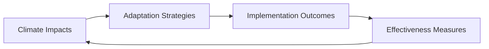
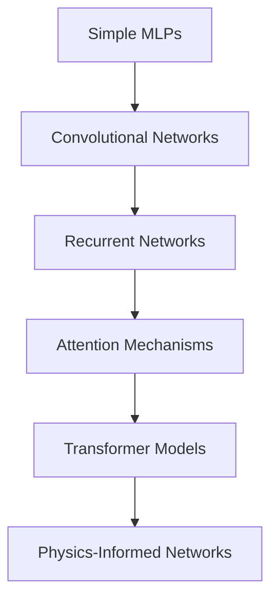

# Advanced Research with Obsidian: Complete Tutorial & Research Report 2025

## Table of Contents
1. [Introduction](#introduction)
2. [Core Advanced Research Methodologies](#core-advanced-research-methodologies)
3. [Essential Plugin Ecosystem](#essential-plugin-ecosystem)
4. [AI & Agentic Integrations](#ai--agentic-integrations)
5. [Vector Databases & RAG Implementation](#vector-databases--rag-implementation)
6. [Academic Workflows & Case Studies](#academic-workflows--case-studies)
7. [Markdown Tooling & Organization Systems](#markdown-tooling--organization-systems)
8. [Comparative Analysis with Other Tools](#comparative-analysis-with-other-tools)
9. [Implementation Roadmap](#implementation-roadmap)
10. [Future Directions](#future-directions)

---

## Introduction

Obsidian has evolved into a powerful research tool that goes beyond simple note-taking, enabling academics to create interconnected knowledge bases that support complex research projects. This comprehensive guide explores advanced research methodologies using Obsidian, based on analysis of current academic workflows, emerging AI integrations, and comparative studies with other research tools.

**Key Benefits of Advanced Obsidian Research:**
- **Non-proprietary data storage**: Your notes are stored in markdown formats which means that even if the tool disappears tomorrow, you won't have to mourn over your notes
- **Interconnected knowledge graphs**: By linking related ideas, Obsidian helps you form a deeper understanding of the topics you're studying or researching
- **Extensible plugin ecosystem**: With thousands of plugins and our open API, it's easy to tailor Obsidian to fit your personal workflow
- **AI integration capabilities**: Obsidian AI Tools integrate multiple AI services—such as Claude, OpenAI, and Gemini—into a single, cohesive platform

---

## Core Advanced Research Methodologies

### The Modern Zettelkasten Approach

The foundation of advanced research in Obsidian builds upon the Zettelkasten method, adapted for digital workflows. The ultimate goal of Zettelkasten is to publish. It is a writer's tool, meant for creating published works.

**Three-Tier Note Architecture:**

1. **Fleeting Notes**: Capture ideas, highlights, or notes from different sources (web articles, videos, books)
2. **Literature Notes**: Essentially a single note for each reference, containing the full metadata, link to Zotero, as well as PDF annotations and notes stored in Zotero
3. **Permanent Notes**: Organise your literature notes into a coherent and interconnected knowledge base that you can reference in the future

### Advanced Workflow Patterns

**The PARA-Enhanced Zettelkasten:**
Modern researchers combine the PARA method (Projects, Areas, Resources, Archive) with Zettelkasten principles:

```
📁 Projects (Current Research)
  ├── 🔬 PhD Dissertation
  ├── 📄 Paper: Climate Change Effects
  └── 🏛️ Conference Presentation
📁 Areas (Ongoing Responsibilities) 
  ├── 🎓 Teaching Materials
  ├── 📖 Literature Review
  └── 🤝 Peer Review
📁 Resources (Future Reference)
  ├── 🧠 Methodologies
  ├── 📊 Datasets
  └── 🔧 Tools & Templates  
📁 Archive (Inactive Items)
```

**Maps of Content (MOCs):**
MOCs help bridge that gap, and allow you to group related notes together with little fuss or mess. Modern MOCs serve as:
- Research topic overviews
- Methodology collections
- Literature synthesis hubs
- Project navigation centers

---

## Essential Plugin Ecosystem

### Research-Critical Plugins

**Core Integration Plugins:**

1. **Zotero Integration** - This plugin allows you to seamlessly integrate your Zotero library with Obsidian, making it easy to insert citations and references into your notes
   - Automatic metadata import
   - PDF annotation sync
   - Citation formatting

2. **Dataview** - Provides a query language for filtering, sorting, and extracting data from Markdown pages
   - Dynamic content queries
   - Research progress tracking
   - Automated bibliography generation

3. **Templater** - Advanced template creation for:
   - Literature note templates
   - Meeting notes
   - Research project structures

**AI-Enhanced Research Plugins:**

4. **Copilot Plugin** - This plugin assists AI-assisted conversations and retrieval-augmented generation (RAG), allowing users to create contextually relevant content with ease

5. **Smart Connections** - Vector-based note relationships

6. **Web Clipper Extensions** - Browser extension that helps you highlight and save content from the web

### Advanced Workflow Plugins

**Content Processing:**
- **Longform**: Managing long scripts
- **LaTeX Suite**: Writing complex notation
- **Linter**: Maintaining consistent formatting
- **Pandoc**: Document conversion and citation management

**Organization & Analysis:**
- **Graph Analysis**: Advanced network visualization
- **Tag Wrangler**: Hierarchical tagging systems
- **File Explorer Note Count**: Research volume tracking

### Plugin Configuration Best Practices

**Academic Research Setup:**
```yaml
# Essential Plugin Configuration
core_plugins:
  - daily_notes
  - graph_view
  - templates
  - search
  - backlinks

community_plugins:
  - zotero_integration
  - dataview
  - templater
  - advanced_tables
  - kanban
  - calendar
  - excalidraw
  - copilot
  - linter
```

---

## AI & Agentic Integrations

### Current AI Integration Landscape

Obsidian AI Tools, powered by Ultimate AI, integrate multiple AI services—such as Claude, OpenAI, and Gemini—into a single, cohesive platform. Modern research workflows leverage AI for:

**Content Generation:**
- Literature summaries
- Research question formulation  
- Hypothesis generation
- Method selection guidance

**Analysis & Synthesis:**
- Pattern identification across notes
- Thematic analysis
- Argument structure evaluation
- Gap identification

### RAG (Retrieval-Augmented Generation) Implementation

**Local RAG Setup:**
N8n orchestrates the flow, RAG provides the intelligence, Qdrant manages the memory, and Google Drive ensures accessibility

**Technical Architecture:**
```
┌─────────────────┐    ┌─────────────────┐    ┌─────────────────┐
│   Obsidian      │───▶│   Vector DB     │───▶│   LLM Query     │
│   Vault         │    │   (Qdrant)      │    │   Interface     │
└─────────────────┘    └─────────────────┘    └─────────────────┘
        │                        │                        │
        ▼                        ▼                        ▼
┌─────────────────┐    ┌─────────────────┐    ┌─────────────────┐
│   File Watcher  │    │   Embedding     │    │   Contextual    │
│   (Auto Sync)   │    │   Generation    │    │   Responses     │
└─────────────────┘    └─────────────────┘    └─────────────────┘
```

**Implementation Steps:**
1. **Vector Database Setup**: Set up Qdrant vector store locally using Docker
2. **Embedding Pipeline**: Convert notes to vector representations
3. **Query Interface**: Natural language research queries
4. **Context Injection**: Feed relevant notes to LLM responses

### Agentic Research Workflows

**CrewAI Integration:** We teamed up with CrewAI, a framework for building intelligent, multi-agent applications

**Agent Roles:**
- **Literature Review Agent**: Automated paper discovery and summarization
- **Analysis Agent**: Pattern recognition and synthesis
- **Writing Agent**: Draft generation and editing
- **Citation Agent**: Reference management and formatting

**Example Workflow:**
```python
# Simplified agent workflow
research_crew = Crew(
    agents=[literature_agent, analysis_agent, writing_agent],
    tasks=[review_task, synthesis_task, writing_task],
    memory_system=QdrantRAGMemory(obsidian_vault_path)
)
```

---

## Vector Databases & RAG Implementation

### Technical Implementation

**Vector Database Options for 2025:**
In the rapidly evolving landscape of data science, vector databases play a pivotal role in enabling efficient storage, retrieval, and manipulation of high-dimensional data

**Recommended Stack:**
1. **Qdrant**: Qdrant acts as a knowledge base, storing the embeddings of the Obsidian notes
2. **ChromaDB**: Lightweight local deployment
3. **Pinecone**: Cloud-native scaling

### Advanced RAG Techniques

**Contextual Retrieval:** The idea is to use LLMs to generate a short context for each chunk, so it situates the chunk in the context of the whole document

**Multi-hop Retrieval:**
- Graph-based traversal of related notes
- Hierarchical information extraction
- Cross-reference validation

**Implementation Example:**
```python
# Graph-RAG Implementation
class ObsidianGraphRAG:
    def __init__(self, vault_path):
        self.vault_path = vault_path
        self.vector_db = QdrantClient()
        self.graph_db = OxigraphStore()
    
    def process_vault(self):
        # File parsing and chunking
        # Vector embedding generation
        # Graph relationship mapping
        # RDF triple creation
        pass
    
    def query(self, question):
        # Multi-hop retrieval
        # Context aggregation
        # Response generation
        pass
```

---

## Academic Workflows & Case Studies

### Successful Research Project Patterns

**PhD Dissertation Management:**
Today, I rely on two in particular: Zotero and Obsidian. Together, they form the heart of my workflow, helping me manage everything from reading and note-taking to writing and publishing

**Case Study: Biomedical Research Vault**
I'm a PhD student in biomedicine and have been using Obsidian to manage my research workflow. Over time, I've developed a vault structured around managing STEM projects; to keep track of literature, experiments, writing, and project management in one place

**Structure & Features:**
- Maps of Content - Overviews linking related notes within research topics
- Literature Review – Zettelkasten-style note-taking
- Experiment tracking and analysis
- Collaborative writing workflows

### Real-World Workflow Examples

**Medieval History Research:**
I'm more or less happy with my workflow (taking highlights from articles/books on my Kindle; exporting these to Obsidian; putting them into atomic notes with subject tags and occasionally adding those notes to various outline/structure/permanent/evergreen notes)

**Deep Learning Research:**
I create a node for each type of networks (for example Graph Neural Networks) and link interesting papers using those networks

**Workflow Pattern:**
1. **Discovery Phase**: Search and preliminary screening
2. **Collection Phase**: Import to Zotero, tag organization
3. **Analysis Phase**: Obsidian note creation, linking
4. **Synthesis Phase**: Canvas-based mind mapping
5. **Production Phase**: Draft generation and refinement

### Project Management Integration

**Canvas-Based Research Organization:**
I would like to discuss one of the best Obsidian tools for me, the canvas. The main drawback with Obsidian is that after a while you will have a lot of notes and it can be hard to find information you need. You can aggregate everything using the canvas as a mindmap

**Research Questions Framework:**
- What are the current methodologies?
- Who are the key researchers?
- What are the limitations?
- What are the future directions?

---

## Markdown Tooling & Organization Systems

### Advanced Markdown Strategies

**Structured Academic Writing:**
The workflow is further enhanced by Obsidian plugins like Longform, Latex Suite, and Linter, which assist in managing long scripts, writing complex notation, and maintaining consistent formatting

#### Comprehensive Template System

**Literature Note Template (Enhanced):**
```markdown
---
title: "{{title}}"
authors: "{{authors}}"
publication: "{{publication}}"
year: {{year}}
doi: "{{doi}}"
url: "{{url}}"
tags: 
  - literature
  - "{{primary_topic}}"
  - "{{methodology}}"
  - year/{{year}}
status: processed
type: literature-note
zotero-key: "{{citekey}}"
created: {{date:YYYY-MM-DD}}
modified: {{date:YYYY-MM-DD}}
confidence: medium
relevance: high
---

# {{title}}

## Publication Info
- **Authors**: {{authors}}
- **Publication**: {{publication}}
- **Year**: {{year}}
- **DOI**: [{{doi}}](https://doi.org/{{doi}})
- **Zotero**: [@{{citekey}}]
- **PDF**: {{pdf_link}}

## Quick Summary (1-2 sentences)
{{brief_summary}}

## Research Question/Problem
What specific problem does this research address?
{{research_question}}

## Methodology
**Type**: {{study_type}} (experimental/survey/theoretical/review)
**Sample Size**: {{sample_size}}
**Methods**: {{methods_used}}
**Duration**: {{study_duration}}

## Key Findings
1. **Primary Finding**: {{primary_finding}}
2. **Secondary Findings**: 
   - {{finding_2}}
   - {{finding_3}}
3. **Statistical Significance**: {{significance_notes}}

## Critical Analysis
**Strengths**:
- {{strength_1}}
- {{strength_2}}

**Limitations**:
- {{limitation_1}}
- {{limitation_2}}

**My Assessment**: {{personal_critique}}

## Relevance to My Research
**Direct Applications**:
- {{application_1}}
- {{application_2}}

**Future Research Directions**:
- {{future_direction_1}}
- {{future_direction_2}}

## Concept Connections
- Related to: [[{{concept_1}}]], [[{{concept_2}}]]
- Contradicts: [[{{contradicting_concept}}]]
- Extends: [[{{building_on_concept}}]]
- Methodology similar to: [[{{similar_method_paper}}]]

## Quotations (with page numbers)
> "{{important_quote_1}}" (p. {{page_number}})

> "{{important_quote_2}}" (p. {{page_number}})

## Follow-up Actions
- [ ] Read related paper: [[{{related_paper}}]]
- [ ] Investigate methodology in: [[{{methodology_paper}}]]
- [ ] Add findings to: [[{{relevant_project_moc}}]]
- [ ] Consider for citation in: [[{{writing_project}}]]

## References Cited by This Paper
{{key_references}}

---
**Last Updated**: {{date:YYYY-MM-DD}}
**Review Status**: {{review_status}}
```

**Research Project Template:**
```markdown
---
title: "{{project_title}}"
type: research-project
status: active
start-date: {{start_date}}
end-date: {{end_date}}
supervisor: "[[{{supervisor_name}}]]"
collaborators: [{{collaborator_list}}]
funding: "{{funding_source}}"
tags:
  - project
  - "{{research_area}}"
  - "{{project_phase}}"
created: {{date:YYYY-MM-DD}}
---

# {{project_title}}

## Project Overview
**Duration**: {{start_date}} to {{end_date}}
**Status**: {{current_status}}
**Funding**: {{funding_details}}
**Team**: [[{{supervisor_name}}]], {{team_members}}

## Research Questions
### Primary Research Question
{{primary_rq}}

### Sub-questions
1. {{sub_question_1}}
2. {{sub_question_2}}
3. {{sub_question_3}}

## Hypotheses
**H1**: {{hypothesis_1}}
**H2**: {{hypothesis_2}}
**Null Hypothesis**: {{null_hypothesis}}

## Methodology Framework
**Research Design**: {{design_type}}
**Data Collection Methods**: 
- {{method_1}}
- {{method_2}}
- {{method_3}}

**Analysis Plan**: {{analysis_approach}}

## Literature Foundation
### Key Papers
```dataview
TABLE 
  authors,
  year,
  relevance
FROM #literature 
WHERE contains(tags, "{{project_tag}}")
SORT year DESC
```

### Theoretical Framework
- **Primary Theory**: [[{{primary_theory}}]]
- **Supporting Concepts**: [[{{concept_1}}]], [[{{concept_2}}]]
- **Contested Areas**: [[{{contested_concept}}]]

## Project Timeline
### Phase 1: Literature Review ({{phase1_dates}})
- [ ] Systematic search strategy
- [ ] Screen {{target_papers}} papers
- [ ] Complete theoretical framework
- [ ] Draft literature review chapter

### Phase 2: Methodology Development ({{phase2_dates}})
- [ ] Finalize research design
- [ ] Develop data collection instruments
- [ ] Ethics approval submission
- [ ] Pilot testing

### Phase 3: Data Collection ({{phase3_dates}})
- [ ] Recruit participants
- [ ] Collect baseline data
- [ ] Implement intervention (if applicable)
- [ ] Collect follow-up data

### Phase 4: Analysis & Writing ({{phase4_dates}})
- [ ] Data cleaning and preparation
- [ ] Statistical/qualitative analysis
- [ ] Results interpretation
- [ ] Draft findings chapters

## Data Management
**Storage Location**: {{data_location}}
**Backup Strategy**: {{backup_plan}}
**Ethics Protocol**: {{ethics_reference}}
**Data Sharing Plan**: {{sharing_protocol}}

## Resources and Tools
**Software**: {{software_list}}
**Equipment**: {{equipment_needs}}
**Budget Allocation**: {{budget_details}}

## Risk Assessment
**High Risk**: {{high_risk_factors}}
**Medium Risk**: {{medium_risk_factors}}
**Mitigation Strategies**: {{risk_mitigation}}

## Dissemination Plan
**Target Journals**: {{journal_list}}
**Conference Presentations**: {{conference_list}}
**Public Engagement**: {{public_engagement_plan}}

## Related Projects
- Similar work: [[{{similar_project}}]]
- Collaborative opportunities: [[{{collab_project}}]]
- Follow-up studies: [[{{future_project}}]]

## Meeting Notes
```dataview
LIST
FROM "Meetings"
WHERE contains(project, "{{project_title}}")
SORT file.cdate DESC
LIMIT 10
```

## Progress Tracking
```dataview
TASK
WHERE contains(tags, "{{project_tag}}")
GROUP BY status
```

---
**Next Review Date**: {{next_review}}
**Last Updated**: {{date:YYYY-MM-DD}}
```

**Meeting Notes Template:**
```markdown
---
type: meeting
project: "[[{{project_name}}]]"
attendees: [{{attendee_list}}]
date: {{date:YYYY-MM-DD}}
duration: {{duration}}
meeting-type: "{{meeting_type}}"
tags:
  - meeting
  - "{{project_tag}}"
  - "{{meeting_category}}"
---

# {{meeting_type}} - {{date:YYYY-MM-DD}}

**Project**: [[{{project_name}}]]
**Date**: {{date:YYYY-MM-DD HH:mm}}
**Duration**: {{duration}} minutes
**Location**: {{location}}
**Chair**: {{meeting_chair}}

## Attendees
- [[{{attendee_1}}]] - {{role_1}}
- [[{{attendee_2}}]] - {{role_2}}
- {{other_attendees}}

## Agenda
1. {{agenda_item_1}}
2. {{agenda_item_2}}
3. {{agenda_item_3}}

## Discussion Points

### {{topic_1}}
**Summary**: {{discussion_summary_1}}
**Key Points**:
- {{key_point_1}}
- {{key_point_2}}

**Decisions Made**:
- {{decision_1}}
- {{decision_2}}

### {{topic_2}}
**Summary**: {{discussion_summary_2}}
**Concerns Raised**:
- {{concern_1}}
- {{concern_2}}

**Resolution**: {{resolution}}

## Action Items
- [ ] {{action_1}} - **Assigned to**: [[{{assignee_1}}]] - **Due**: {{due_date_1}}
- [ ] {{action_2}} - **Assigned to**: [[{{assignee_2}}]] - **Due**: {{due_date_2}}
- [ ] {{action_3}} - **Assigned to**: [[{{assignee_3}}]] - **Due**: {{due_date_3}}

## Follow-up Required
- {{followup_1}}
- {{followup_2}}

## Next Meeting
**Scheduled**: {{next_meeting_date}}
**Focus**: {{next_meeting_focus}}
**Preparation Required**: {{prep_required}}

## Related Documents
- Previous meeting: [[{{previous_meeting}}]]
- Referenced papers: [[{{paper_1}}]], [[{{paper_2}}]]
- Project documents: [[{{project_doc}}]]

---
**Meeting Record ID**: {{meeting_id}}
**Minutes Approved**: {{approval_status}}
```

#### Advanced Markdown Techniques

**Cross-Reference Systems:**
Understanding how to create sophisticated cross-reference systems helps build truly interconnected knowledge bases. Think of this as creating multiple layers of connections that serve different purposes.

**Semantic Linking Patterns:**
```markdown
<!-- Direct conceptual relationships -->
This finding supports [[Previous Study Results]] but contradicts [[Alternative Theory]].

<!-- Methodological connections -->
The approach used here builds on [[Baseline Methodology]] with modifications from [[Recent Innovation]].

<!-- Temporal relationships -->
This represents an evolution from [[Historical Approach]] toward [[Future Direction]].

<!-- Evidence hierarchies -->
**Strong Evidence**: [[High Confidence Finding]]
**Supporting Evidence**: [[Corroborating Study 1]], [[Corroborating Study 2]]
**Conflicting Evidence**: [[Contradictory Result]] - needs resolution
```

**Progressive Disclosure in Notes:**
Think of your notes as having multiple levels of detail that serve different readers (including future you). Structure information from general to specific, allowing quick scanning while preserving depth.

```markdown
# Quick Executive Summary (30 seconds)
{{one_sentence_summary}}

# Key Insights (2 minutes)
{{three_bullet_points}}

# Detailed Analysis (10 minutes)
{{full_discussion}}

# Technical Details (complete reference)
{{comprehensive_analysis}}
```

### Organization Methodologies

**PARA Method Implementation:**
- **Projects**: Active research with deadlines
- **Areas**: Ongoing academic responsibilities  
- **Resources**: Reference materials and methodologies
- **Archive**: Completed projects and inactive materials

**Johnny Decimal Integration:**
```
10-19 Current Projects
  11 PhD Dissertation
    11.01 Literature Review
    11.02 Methodology
    11.03 Data Analysis
  12 Conference Paper
    12.01 Draft
    12.02 Revisions

20-29 Teaching
  21 Course Materials
  22 Student Resources

30-39 Research Areas
  31 Climate Science
  32 Machine Learning
```

### Advanced Organization Frameworks

#### The Hybrid Connection-Based System

Modern Obsidian organization has evolved beyond traditional folder hierarchies toward what we call "connection-based knowledge management." Think of this as creating a living, breathing network of ideas rather than static filing cabinets. This approach recognizes that knowledge doesn't fit neatly into single categories—ideas exist in multiple contexts simultaneously and connect in ways we often don't anticipate when first capturing them.

**Core Philosophy Evolution:**
The Obsidian community has shifted from asking "Where should I put this?" to "How does this connect to what I already know?" This fundamental change in thinking transforms how we approach knowledge organization. Instead of creating rigid hierarchies that constrain our thinking, we build flexible networks that enhance and amplify our cognitive abilities.

**The Four Pillars of Modern Organization:**

1. **Web-like Connections**: Ideas connect organically across traditional boundaries
2. **Search-first Discovery**: Finding information through multiple pathways
3. **Flexible Adaptation**: Systems that evolve with your thinking
4. **Multiple Contexts**: Information accessible through various entry points

#### Maps of Content (MOCs): The Master Strategy

Maps of Content represent one of the most powerful organizational tools in modern knowledge management. Think of MOCs as intelligent indexes that don't just list information, but actively organize and contextualize it. Unlike traditional indexes that provide static references, MOCs create dynamic relationships between concepts and can evolve as your understanding deepens.

**Why MOCs Excel Over Traditional Organization:**

MOCs solve the fundamental problem of rigid categorization. In traditional systems, you must decide where something belongs and it stays there. With MOCs, you can create multiple organizational schemes that coexist, each serving different purposes and perspectives.

**Core MOC Principles:**
- **Infinitely Flexible**: Notes can appear in multiple MOCs without duplication
- **Self-Documenting**: The organization explains itself through relationships
- **Encourage Productive Repetition**: Seeing the same concept in different contexts sparks new insights
- **Auto-Updating**: Changes to linked notes automatically propagate throughout

**MOC Architecture Examples:**

**Research Project MOC (Comprehensive Example):**
```markdown
# Climate Change Adaptation Research - Master MOC

*Last Updated: 2025-01-15 | Status: Active | Phase: Data Collection*

## Project Overview Dashboard
- **Timeline**: [[Project Timeline - Climate Adaptation]]
- **Budget Tracking**: [[Budget Analysis - Climate Project]]
- **Team Directory**: [[Research Team Contacts]]
- **Ethics Approval**: [[Ethics Documentation - Climate Study]]

## Research Foundation
### Literature Architecture
- **Foundational Theories**: [[Climate Adaptation Theory MOC]]
- **Recent Advances**: [[2024-2025 Climate Literature MOC]]
- **Methodology Papers**: [[Adaptation Measurement Methods MOC]]
- **Contradictory Findings**: [[Climate Controversies Analysis MOC]]

### Conceptual Framework


## Research Questions Hierarchy
### Primary Research Questions
1. [[RQ1 - How do communities select adaptation strategies?]]
2. [[RQ2 - What factors predict adaptation success?]]
3. [[RQ3 - How do social networks influence adaptation?]]

### Secondary Questions
- [[RQ2.1 - Role of leadership in adaptation success]]
- [[RQ2.2 - Economic factors in strategy selection]]
- [[RQ3.1 - Information flow in community networks]]
- [[RQ3.2 - Trust dynamics in adaptation planning]]

## Methodology Framework
### Data Collection Architecture
- **Survey Instruments**: [[Community Adaptation Survey Design]]
- **Interview Protocols**: [[Stakeholder Interview Guides]]
- **Observational Framework**: [[Community Meeting Observation Protocol]]
- **Document Analysis**: [[Policy Document Analysis Framework]]

### Analysis Strategy
- **Quantitative Approach**: [[Statistical Analysis Plan - Climate]]
- **Qualitative Methods**: [[Thematic Analysis Protocol]]
- **Mixed Methods Integration**: [[Data Triangulation Strategy]]

## Data Organization
### Current Data Status
```dataview
TABLE 
  collection-status as "Status",
  sample-size as "N",
  completion-date as "Target Date"
FROM "Data Collection"
WHERE project = "Climate Adaptation"
SORT completion-date ASC
```

### Analysis Progress
- **Descriptive Statistics**: [[Baseline Community Characteristics]]
- **Network Analysis**: [[Social Network Mapping Results]]
- **Case Study Profiles**: [[Community Case Studies MOC]]

## Knowledge Synthesis
### Emerging Themes
- **Community Resilience Factors**: [[Resilience Themes Analysis]]
- **Adaptation Barriers**: [[Implementation Challenges]]
- **Success Pattern Recognition**: [[Effective Adaptation Models]]

### Cross-Case Comparisons
- **Rural vs Urban Adaptation**: [[Rural-Urban Adaptation Comparison]]
- **Economic Factor Analysis**: [[Socioeconomic Adaptation Patterns]]
- **Governance Impact Studies**: [[Leadership Effectiveness Analysis]]

## Writing and Dissemination
### Publication Pipeline
- **Journal Article 1**: [[Community Networks and Adaptation - Draft]]
  - Status: First draft complete
  - Target Journal: [[Environmental Research Letters]]
  - Submission Timeline: [[Article 1 - Publication Timeline]]

- **Conference Presentations**: [[Climate Conference Presentations MOC]]
- **Policy Briefs**: [[Climate Policy Communication MOC]]

### Stakeholder Engagement
- **Community Reports**: [[Community Feedback Reports]]
- **Policy Maker Briefings**: [[Government Briefing Materials]]
- **Academic Presentations**: [[Academic Conference Materials]]

## Resource Management
### Tools and Infrastructure
- **Software Stack**: [[Climate Research Tools MOC]]
- **Data Management**: [[Climate Data Management Protocol]]
- **Collaboration Tools**: [[Team Collaboration Setup]]

### Budget and Timeline Tracking
```dataview
TABLE
  budget-category as "Category",
  allocated as "Budgeted",
  spent as "Spent",
  remaining as "Remaining"
FROM "Budget Tracking"
WHERE project = "Climate Adaptation"
```

## Quality Assurance
### Validation Strategies
- **Member Checking**: [[Community Validation Protocols]]
- **Peer Review Process**: [[Research Review Timeline]]
- **External Audit Trail**: [[Quality Assurance Documentation]]

### Risk Management
- **Data Security**: [[Climate Data Security Protocol]]
- **Participant Privacy**: [[Privacy Protection Measures]]
- **Timeline Risks**: [[Project Risk Assessment]]

## Connection Networks
### Related Research Areas
- **Urban Planning**: [[Urban Climate Planning MOC]]
- **Social Psychology**: [[Community Behavior Research MOC]]
- **Environmental Policy**: [[Climate Policy Analysis MOC]]

### Methodological Connections
- **Network Analysis Methods**: [[Social Network Analysis Techniques]]
- **Community-Based Research**: [[Participatory Research Methods MOC]]
- **Mixed Methods Design**: [[Integrated Research Approaches]]

## Future Directions
### Follow-up Studies
- [[Longitudinal Adaptation Tracking Study]]
- [[Cross-National Adaptation Comparison]]
- [[Climate Technology Adoption Research]]

### Collaboration Opportunities
- [[International Climate Research Network]]
- [[Community Partnership Development]]
- [[Policy Implementation Studies]]

---

## Daily Working Areas
- **Today's Focus**: {{daily_focus_area}}
- **Current Task**: {{current_task}}
- **Next Milestone**: {{next_milestone}}

## Quick Access Links
- [Project Folder](./Climate-Adaptation-Project/)
- [[Daily Research Log - Climate Project]]
- [[Weekly Team Meeting Notes]]
- [[Monthly Progress Reports]]

---
*This MOC serves as the central navigation hub for the Climate Change Adaptation Research Project. All project-related notes should eventually connect back to this central organizing structure.*
```

**Literature Review MOC (Domain-Specific Example):**
```markdown
# Machine Learning in Climate Science - Literature MOC

*Domain Focus: AI/ML Applications in Climate Research | Updated: 2025-01-15*

## Literature Architecture Overview
This MOC organizes the growing body of literature on machine learning applications in climate science, tracking theoretical developments, methodological advances, and practical applications.

## Theoretical Foundations
### Core ML-Climate Intersection Papers
- [[Reichstein2019 - Deep Learning Climate Science]] - *Foundational review*
- [[Barnes2020 - Viewpoint Machine Learning Climate]] - *Philosophical framework*
- [[McGovern2017 - ML Weather Climate Extremes]] - *Extreme events focus*

### Methodological Frameworks
```dataview
TABLE
  title as "Paper",
  authors as "Authors", 
  method-type as "ML Method",
  climate-application as "Climate Domain",
  year as "Year"
FROM #literature AND #ml-climate AND #methodology
SORT year DESC
```

## Application Domains

### 1. Weather Prediction and Forecasting
**Foundation Papers**:
- [[Scher2018 - Weather Forecasting Neural Networks]] - *Pioneering work*
- [[Weyn2020 - ML Weather Prediction]] - *Operational applications*
- [[Pathak2022 - FourCastNet Weather Prediction]] - *Recent advances*

**Method Evolution**:
- Traditional Approaches → Neural Weather Models → Transformer-based Systems
- **Key Innovation Timeline**: [[Weather ML Innovation Timeline]]

**Performance Comparisons**:
```dataview
TABLE
  model-name as "Model",
  accuracy-metric as "Performance",
  prediction-horizon as "Forecast Range",
  computational-cost as "Cost"
FROM #weather-prediction AND #performance-comparison
SORT accuracy-metric DESC
```

### 2. Climate Change Attribution
**Conceptual Framework**:
Understanding how machine learning enhances traditional climate attribution studies by identifying subtle signals in noisy climate data.

**Key Studies**:
- [[Barnes2020 - ML Climate Attribution]] - *Detection methodology*
- [[Toms2020 - ML Extreme Attribution]] - *Event attribution*
- [[Stuart2021 - Deep Learning Attribution]] - *Regional applications*

**Attribution Method Comparison**:
| Traditional Methods | ML-Enhanced Methods | Hybrid Approaches |
|---------------------|---------------------|-------------------|
| [[Statistical Attribution Methods]] | [[Deep Learning Attribution]] | [[ML-Traditional Integration]] |
| Well-validated | Higher sensitivity | Best practices emerging |
| Limited pattern detection | Complex pattern recognition | Combines strengths |

### 3. Climate Model Emulation
**Research Motivation**:
Climate models are computationally expensive. ML emulators can approximate model behavior at a fraction of the computational cost, enabling broader experimentation and uncertainty quantification.

**Emulation Approaches**:
- **Process-based Emulation**: [[Physics-Informed Neural Networks Climate]]
- **Statistical Emulation**: [[Gaussian Process Climate Models]]
- **Deep Learning Emulation**: [[Neural Network Climate Emulators]]

**Validation Frameworks**:
- [[Emulator Validation Protocols]] - *Best practices*
- [[Climate Model Benchmarking]] - *Performance standards*
- [[Uncertainty Quantification Methods]] - *Error characterization*

## Methodological Deep Dives

### Neural Network Architectures in Climate Science
**Architecture Evolution**:


**Architecture-Application Mapping**:
- **CNNs**: Spatial pattern recognition → [[CNN Climate Applications]]
- **RNNs**: Temporal sequence modeling → [[RNN Climate Forecasting]]
- **Transformers**: Long-range dependencies → [[Transformer Climate Models]]
- **PINNs**: Physics-constrained learning → [[Physics-Informed Climate ML]]

### Data Challenges and Solutions
**Common Data Problems**:
1. **Irregular Spatiotemporal Sampling**: [[Irregular Data ML Solutions]]
2. **Multi-scale Phenomena**: [[Multi-scale ML Climate Methods]]
3. **Limited Training Data**: [[Small Data Climate ML]]
4. **Measurement Uncertainties**: [[Uncertainty-Aware ML Climate]]

**Preprocessing Pipelines**:
- [[Climate Data Preprocessing Workflows]]
- [[Quality Control ML Methods]]
- [[Gap Filling Techniques Climate Data]]

## Emerging Themes and Trends

### 2024-2025 Research Frontiers
**Hot Topics**:
- **Foundation Models for Climate**: [[Climate Foundation Models Research]]
- **Explainable AI in Climate**: [[XAI Climate Applications]]
- **Federated Learning**: [[Distributed Climate ML]]
- **Causal Discovery**: [[Causal Inference Climate]]

**Methodological Innovations**:
```dataview
LIST
FROM #literature AND #ml-climate AND #year/2024 OR #year/2025
WHERE contains(tags, "innovation")
SORT file.cdate DESC
```

### Cross-Disciplinary Connections
**Interdisciplinary Bridge Papers**:
- **ML + Atmospheric Physics**: [[Physics-ML Integration Studies]]
- **ML + Oceanography**: [[Ocean ML Applications]]
- **ML + Hydrology**: [[Hydrological ML Methods]]
- **ML + Ecology**: [[Ecosystem ML Modeling]]

## Critical Analysis and Debates

### Methodological Controversies
**Major Debates**:
1. **Interpretability vs Performance**: [[ML Climate Interpretability Debate]]
2. **Data-Driven vs Physics-Based**: [[Physics vs Data Driven Climate ML]]
3. **Scale Transfer Problems**: [[ML Climate Scale Transfer Issues]]

**Limitation Analyses**:
- [[ML Climate Model Limitations]] - *Systematic analysis*
- [[Failure Mode Documentation]] - *When ML fails*
- [[Overfitting in Climate ML]] - *Common pitfalls*

### Reproducibility and Standards
**Best Practice Documentation**:
- [[Climate ML Reproducibility Guidelines]]
- [[Code and Data Sharing Standards]]
- [[Benchmark Dataset Recommendations]]

## Knowledge Gaps and Future Directions

### Identified Research Gaps
```dataview
TASK
FROM #literature AND #ml-climate
WHERE contains(future-work, "gap") OR contains(limitations, "unexplored")
GROUP BY research-area
```

### Promising Research Directions
- **Multi-modal Climate Data Integration**: [[Multi-modal Climate ML Future]]
- **Real-time Adaptive Models**: [[Adaptive Climate ML Systems]]
- **Uncertainty Quantification**: [[Uncertainty ML Climate Future]]

## Literature Management

### Reading Pipeline
**Priority Categories**:
1. **Must Read Immediately**: High-impact recent papers
2. **Review Within Month**: Relevant but not urgent
3. **Archive for Reference**: Background materials

**Current Reading Queue**:
```dataview
TABLE
  title as "Paper",
  priority as "Priority",
  reading-status as "Status",
  estimated-time as "Reading Time"
FROM #literature AND #ml-climate AND #reading-queue
WHERE reading-status != "complete"
SORT priority ASC, file.cdate DESC
```

### Citation Networks
**Highly Cited Foundation Papers**:
```dataview
TABLE
  title as "Paper",
  authors as "Authors",
  citation-count as "Citations",
  influence-score as "Influence"
FROM #literature AND #ml-climate
WHERE citation-count > 100
SORT citation-count DESC
```

### Author Networks
**Key Researchers to Follow**:
- [[Amy McGovern]] - *Extreme weather ML*
- [[Markus Reichstein]] - *Ecosystem ML*  
- [[Claire Monteleoni]] - *Climate informatics*
- [[Jakob Runge]] - *Causal discovery*

**Research Group Mapping**:
- [[Climate Informatics Research Groups]]
- [[Industry-Academic Collaborations]]
- [[International Research Networks]]

---

## Navigation and Maintenance

### Quick Access
- **Recent Papers**: [[Recently Added ML Climate Papers]]
- **Key Reviews**: [[ML Climate Review Papers MOC]]
- **My Research Connections**: [[My Research - ML Climate Connections]]

### MOC Maintenance Schedule
- **Weekly**: Add new papers, update reading queue
- **Monthly**: Review citation networks, update trends analysis  
- **Quarterly**: Major reorganization, archive old materials
- **Annually**: Comprehensive review, methodology updates

---
*This Literature MOC serves as a comprehensive guide to the ML-climate literature. It should be updated regularly as new papers are added to the collection and as understanding of the field evolves.*
```

**Personal Knowledge MOC (Individual Workflow Example):**
```markdown
# Personal Knowledge Management System - Master MOC

*My Second Brain Architecture | Updated: 2025-01-15*

## System Overview
This MOC represents the central organizing principle for my personal knowledge management system. It connects all areas of learning, research, and professional development into a coherent, searchable, and actionable knowledge base.

## Core Knowledge Domains

### Professional Expertise Areas
- **Primary Research Focus**: [[Climate Science Research MOC]]
- **Secondary Specializations**: [[Data Science Methods MOC]], [[Science Communication MOC]]
- **Emerging Interests**: [[AI Ethics MOC]], [[Sustainability Policy MOC]]

### Learning and Development
```dataview
TABLE
  domain as "Knowledge Area",
  proficiency-level as "Current Level",
  learning-priority as "Priority",
  next-milestone as "Next Goal"
FROM #learning-domain
WHERE status = "active"
SORT learning-priority ASC
```

## Information Flow Architecture

### Input Streams
**Daily Information Sources**:
- **Academic Literature**: Processed through [[Literature Review Workflow]]
- **News and Media**: Filtered through [[Current Events Processing]]
- **Podcasts and Videos**: Captured in [[Media Consumption Log]]
- **Conversations and Meetings**: Documented in [[Interaction Notes System]]

**Processing Workflows**:
1. **Capture Phase**: All inputs → [[Daily Inbox]]
2. **Processing Phase**: Inbox → Appropriate processing workflow
3. **Integration Phase**: Processed information → Knowledge domains
4. **Application Phase**: Knowledge → Projects and outputs

### Output Applications
**Knowledge Products**:
- **Research Publications**: [[Academic Writing Pipeline]]
- **Teaching Materials**: [[Course Development System]]
- **Blog Posts and Articles**: [[Public Writing Workflow]]
- **Presentations**: [[Presentation Development MOC]]

## Daily Workflows

### Morning Knowledge Routine (30 minutes)
```markdown
### 9:00-9:10 AM: Inbox Review
- [ ] Check [[Daily Inbox]] for overnight additions
- [ ] Quick scan of urgent items
- [ ] Prioritize processing for the day

### 9:10-9:20 AM: Literature Check
- [ ] Review [[Literature Alert System]]
- [ ] Add relevant papers to [[Reading Queue]]
- [ ] Check for responses to my recent publications

### 9:20-9:30 AM: Knowledge Connections
- [ ] Review [[Daily Connection Suggestions]]
- [ ] Strengthen 2-3 weak links in knowledge graph
- [ ] Update any project-relevant MOCs
```

### Evening Integration Routine (20 minutes)
```markdown
### 5:30-5:40 PM: Daily Processing
- [ ] Process [[Daily Inbox]] items
- [ ] Create/update permanent notes from fleeting notes
- [ ] Link new knowledge to existing structures

### 5:40-5:50 PM: Reflection and Planning  
- [ ] Update [[Daily Research Log]]
- [ ] Identify knowledge gaps discovered today
- [ ] Plan tomorrow's learning priorities
```

## Project Integration System

### Active Projects Dashboard
```dataview
TABLE
  project-name as "Project",
  status as "Status",
  next-deadline as "Next Deadline",
  completion-percentage as "Progress"
FROM #project AND #status/active
SORT next-deadline ASC
```

### Project-Knowledge Connections
**How Knowledge Feeds Projects**:
Each active project maintains bidirectional connections with relevant knowledge domains. This ensures that new learning immediately benefits current work, while project challenges identify knowledge gaps for targeted learning.

**Connection Examples**:
- **Climate Adaptation Project** ← → [[Climate Science Research MOC]], [[Community Resilience Knowledge]]
- **Data Science Course** ← → [[Teaching Methods MOC]], [[Data Science Methods MOC]]
- **Policy Brief Writing** ← → [[Science Communication MOC]], [[Policy Analysis Methods]]

## Learning and Growth Tracking

### Skill Development Framework
**Current Learning Goals** (2025 Q1):
1. **Advanced Statistics**: [[Bayesian Methods Learning Path]]
   - Current Level: Intermediate
   - Target: Advanced by June 2025
   - Resources: [[Statistics Learning Resources]]

2. **Science Communication**: [[Public Engagement Skills]]
   - Current Level: Beginner
   - Target: Intermediate by December 2025
   - Resources: [[Communication Training Materials]]

### Knowledge Gap Management
**Identified Gaps**:
```dataview
TASK
FROM #knowledge-gap
WHERE status = "identified"
GROUP BY priority-level
SORT priority-level ASC
```

**Gap Filling Strategies**:
- **High Priority Gaps**: Dedicated learning projects
- **Medium Priority**: Opportunistic learning during regular work
- **Low Priority**: Long-term development queue

## Quality Assurance and Maintenance

### Weekly Knowledge Review (Friday, 4:00-5:00 PM)
```markdown
### System Health Check (15 minutes)
- [ ] Review orphaned notes (notes with no connections)
- [ ] Check for duplicate content
- [ ] Update MOC modification dates
- [ ] Clean up tags and ensure consistency

### Knowledge Integration Review (20 minutes)
- [ ] Identify strongest new connections made this week
- [ ] Review and strengthen weak connections
- [ ] Look for emerging patterns in recent notes
- [ ] Update relevant MOCs with weekly insights

### Learning Progress Assessment (15 minutes)
- [ ] Review progress on current learning goals
- [ ] Identify unexpected learning from the week
- [ ] Plan next week's targeted learning
- [ ] Update skill proficiency assessments

### Future Planning (10 minutes)
- [ ] Review and update project priorities
- [ ] Identify needed knowledge for upcoming projects
- [ ] Plan next month's knowledge development focus
```

### Monthly Deep Maintenance (2 hours)
**Structure Analysis**:
- Graph view analysis for structural insights
- MOC effectiveness evaluation  
- Workflow optimization review
- Tool and method assessment

**Content Quality Review**:
- Note completeness and accuracy checking
- Citation and source verification
- Knowledge currency assessment
- Redundancy elimination

### Quarterly System Evolution (Half day)
**Strategic Review**:
- Knowledge system effectiveness assessment
- Professional development progress review
- Tool and technology updates
- Workflow and method innovations

## Advanced Search and Discovery

### Search Strategies by Purpose
**Research Mode Searches**:
- Concept combination searches: `"climate adaptation" AND "social networks"`
- Methodology searches: `tag:#methodology path:"Research Methods"`
- Citation searches: `"Smith 2023" OR "Smith et al."`

**Learning Mode Searches**:
- Gap identification: `tag:#knowledge-gap OR tag:#learning-needed`
- Progress tracking: `tag:#learning-goal status:active`
- Review preparation: `tag:#review-due date:today`

**Application Mode Searches**:
- Project resource location: `project:"Climate Adaptation" type:resource`
- Template and tool searches: `tag:#template OR tag:#workflow-tool`
- Example and case study searches: `tag:#example domain:"climate science"`

### Discovery Automation
**Automated Connection Suggestions**:
Using plugins like Smart Connections and Graph Analysis to identify:
- Potentially related notes that aren't yet linked
- Concepts that appear frequently together
- Knowledge clusters that might benefit from MOC creation
- Underutilized knowledge areas

**Weekly Discovery Routine**:
```markdown
### Connection Discovery (20 minutes weekly)
1. Run automated connection analysis
2. Review suggested links for relevance
3. Create 3-5 new high-value connections
4. Identify emerging themes or patterns
5. Plan MOC updates based on discoveries
```

## Collaboration and Sharing

### Knowledge Sharing Protocols
**Internal Team Sharing**:
- **Shared MOCs**: Collaborative project organization
- **Standardized Templates**: Consistent capture methods
- **Regular Knowledge Sync**: Weekly sharing sessions
- **Collective Learning**: Group learning goal coordination

**External Knowledge Contribution**:
- **Blog Post Pipeline**: [[Public Knowledge Sharing Workflow]]
- **Academic Publications**: [[Research Publication System]]
- **Conference Presentations**: [[Presentation Sharing Protocol]]
- **Social Media**: [[Knowledge Tweet Creation System]]

### Privacy and Security Management
**Information Classification**:
- **Public**: Shareable without restriction
- **Professional**: Shareable within professional networks
- **Private**: Personal reflections and sensitive information
- **Confidential**: Research data and proprietary information

**Security Protocols**:
- Regular backup procedures
- Access control for sensitive materials
- Version control for collaborative work
- Privacy review before sharing

---

## System Metrics and Evolution

### Knowledge System Health Metrics
**Connection Density**: Average links per note
**Coverage Ratio**: Percentage of knowledge domains with active development
**Application Rate**: Percentage of knowledge used in active projects
**Growth Rate**: New knowledge integration per week
**Quality Score**: Peer and self-assessment of knowledge accuracy

### Evolution Tracking
**System Changes Log**: [[PKM System Evolution Log]]
**Method Experimentation**: [[Knowledge Method Experiments]]
**Tool Evaluation**: [[PKM Tool Assessment History]]
**Workflow Optimization**: [[Workflow Improvement History]]

---
*This Personal Knowledge MOC serves as the meta-organizing structure for all knowledge management activities. It should be reviewed and updated regularly to ensure it continues to serve evolving learning and professional goals.*
```

#### Advanced MOC Strategies

**Temporal MOCs** help organize knowledge across time dimensions. These are particularly valuable for tracking how understanding evolves, managing project timelines, and maintaining historical context.

**Historical Evolution MOC Example:**
```markdown
# Climate Science Understanding Evolution - Temporal MOC

## Historical Phases
### Early Foundations (1850-1950)
- [[Fourier 1827 - Greenhouse Effect Discovery]]
- [[Arrhenius 1896 - CO2 Climate Sensitivity]]
- [[Callendar 1938 - Human CO2 Emissions]]

### Modern Climate Science (1950-2000)
- [[Keeling Curve - CO2 Measurements]]
- [[Climate Model Development History]]
- [[IPCC Establishment and Early Reports]]

### Contemporary Understanding (2000-Present)
- [[Climate Attribution Methods]]
- [[Extreme Weather Attribution]]
- [[Tipping Points Research]]

## Conceptual Evolution Tracking
```dataview
TABLE
  concept as "Concept",
  initial-understanding as "Early View",
  current-understanding as "Current View",
  key-evolution-papers as "Pivotal Papers"
FROM #concept-evolution AND #climate-science
SORT evolution-date ASC
```
```

**Cross-Disciplinary MOCs** bridge different knowledge domains, essential for interdisciplinary research and innovation.

**Interdisciplinary Connections MOC:**
```markdown
# Climate Science ↔ Social Psychology - Interdisciplinary MOC

## Shared Concepts
- **Risk Perception**: How people understand climate risks
  - Climate Science: [[Physical Risk Assessment Methods]]
  - Psychology: [[Risk Perception Theory]]
  - Integration: [[Climate Risk Communication Research]]

- **Behavioral Change**: How people adapt to climate information
  - Climate Science: [[Climate Adaptation Strategies]]
  - Psychology: [[Behavior Change Models]]
  - Integration: [[Climate Behavior Research]]

## Methodological Bridges
- **Survey Design**: Climate attitudes and knowledge assessment
- **Experimental Methods**: Testing climate communication effectiveness  
- **Mixed Methods**: Combining physical and social data
```

---

## Comparative Analysis with Other Tools

### Feature Matrix Comparison

| Tool | Local Storage | AI Integration | Graph View | Plugin Ecosystem | Academic Focus |
|------|---------------|----------------|------------|------------------|----------------|
| **Obsidian** | ✅ Markdown | ⭐⭐⭐⭐⭐ | ⭐⭐⭐⭐⭐ | ⭐⭐⭐⭐⭐ | ⭐⭐⭐⭐⭐ |
| **Notion** | ❌ Cloud-only | ⭐⭐⭐ | ❌ | ⭐⭐ | ⭐⭐⭐ |
| **Roam Research** | ❌ Cloud-only | ⭐⭐ | ⭐⭐ | ⭐⭐ | ⭐⭐⭐⭐ |
| **Logseq** | ✅ Markdown | ⭐⭐⭐ | ⭐⭐⭐ | ⭐⭐⭐ | ⭐⭐⭐⭐ |
| **RemNote** | ❌ Cloud-only | ⭐⭐ | ⭐⭐ | ⭐⭐ | ⭐⭐⭐⭐ |

### Detailed Tool Analysis

**Obsidian vs. Roam Research:**
Obsidian's graph view is incredible. Not only is it super-fast, but you can apply filters, create groups, and even change the look and functionality of the graph itself

**Obsidian vs. Logseq:**
Obsidian is distinguished by its speed, stability, a seemingly unlimited library of themes and plug-ins, and an approachable online community of friendly, eager users and developers

**Obsidian vs. Notion:**
Obsidian and LogSeq appeal to those looking for a non-proprietary, locally-stored knowledge base using Markdown links between notes

### When to Choose Obsidian

**Optimal Use Cases:**
- Long-term research projects (5+ years)
- Complex multi-disciplinary research
- Heavy citation and reference management
- Need for advanced AI integration
- Requirement for data sovereignty
- Collaborative research with version control

**Potential Limitations:**
- Steeper learning curve than Notion
- Requires technical setup for advanced features
- Plugin dependency for specialized workflows

---

## Implementation Roadmap

### Phase 1: Foundation Setup (Weeks 1-2)

**Week 1: Core Installation**
- Install Obsidian and essential plugins
- Configure Zotero integration
- Set up basic template structure
- Establish folder hierarchy

**Week 2: Workflow Integration**
- Import existing research notes
- Configure citation workflow
- Set up daily notes routine
- Begin literature note creation

### Phase 2: Advanced Features (Weeks 3-4)

**Week 3: Plugin Ecosystem**
- Configure Dataview queries
- Set up Canvas workflows
- Implement advanced templates
- Configure graph view filters

**Week 4: AI Integration**
- Set up local RAG system
- Configure AI writing assistants
- Implement automated workflows
- Test vector database queries

### Phase 3: Optimization & Scaling (Weeks 5-8)

**Week 5-6: Workflow Refinement**
- Optimize search and retrieval
- Refine template systems
- Establish quality control processes
- Create backup and sync strategies

**Week 7-8: Advanced Applications**
- Implement agentic workflows
- Configure collaborative features
- Develop custom plugins (if needed)
- Establish maintenance routines

### Phase 4: Mastery & Innovation (Ongoing)

**Continuous Improvement:**
- Regular workflow audits
- Plugin ecosystem updates
- Community engagement
- Innovation experimentation

---

## Future Directions

### Emerging Trends 2025

**AI Integration Evolution:**
- Multi-modal research support (text, images, audio)
- Real-time collaboration with AI agents
- Automated hypothesis generation
- Predictive research direction mapping

**Technical Advancements:**
- A powerful local-first Graph-RAG system that combines ChromaDB vector search, Oxigraph RDF graph database (with embedded RocksDB), and Gemini 2.5 Flash for intelligent Q&A over your Obsidian vault
- Enhanced vector database integration
- Improved semantic search capabilities
- Cross-platform synchronization

### Research Methodology Evolution

**Collaborative Intelligence:**
- Human-AI research partnerships
- Distributed knowledge networks
- Real-time peer review integration
- Global research collaboration platforms

**Quality Assurance:**
- Automated fact-checking
- Source verification systems
- Bias detection algorithms
- Reproducibility tracking

---

## Conclusion

Advanced research with Obsidian represents a paradigm shift toward intelligent, interconnected, and AI-augmented academic workflows. The biggest advantage compared to a top-down storage system organized by topics is that the Zettelkasten system becomes more and more valuable as it grows, instead of getting messy and confusing

The integration of traditional academic research methodologies with modern AI tools, vector databases, and advanced plugin ecosystems creates unprecedented opportunities for knowledge discovery and synthesis. As the research landscape continues to evolve, Obsidian's flexible architecture and active community position it as a leading platform for advanced academic research.

**Key Takeaways:**
1. **Methodological Foundation**: Combine Zettelkasten principles with modern organizational systems
2. **Technical Integration**: Leverage AI, vector databases, and advanced plugins
3. **Workflow Optimization**: Implement systematic approaches to research project management
4. **Future Readiness**: Prepare for emerging AI-integrated research methodologies
5. **Community Engagement**: Participate in the evolving ecosystem of research tools

The future of academic research lies in the seamless integration of human intelligence with AI capabilities, supported by robust, flexible, and interoperable tool ecosystems. Obsidian, with its commitment to data sovereignty, extensibility, and community-driven development, provides an ideal foundation for this evolution.

---

*This report represents a comprehensive analysis of advanced research methodologies using Obsidian as of August 2025. The field continues to evolve rapidly, and readers are encouraged to engage with the active Obsidian community for the latest developments and best practices.*