# Obsidian Markdown Guide for AI Agents

This guide focuses on Obsidian-specific markdown syntax, formatting, and content creation. For vault management, file operations, and safety protocols, see the companion [OBSIDIAN-VAULT-GUIDE.md](OBSIDIAN-VAULT-GUIDE.md).

**AI Agent Note**: This guide includes formatting requirements for popular plugins and best practices from the Obsidian Linter community plugin.

## Core Obsidian Concepts

### What is Obsidian?
Obsidian is a knowledge management application that creates a network of interconnected notes using markdown files. It treats your collection of notes as a "vault" - a connected knowledge graph where notes can reference and embed each other.

### Key Concepts for Content Creation
- **Notes**: Markdown `.md` files containing your content
- **Links**: Connections between notes using `[[]]` or standard markdown syntax
- **Embeds**: Inline display of content from other files using `![[]]`
- **Properties**: YAML frontmatter for metadata
- **Tags**: Organizational markers using `#tag` or YAML properties
- **Blocks**: Referenceable sections with `^block-id` identifiers
- **Plugin Integration**: Core plugins like Daily Notes, Bases, Canvas, and Slides have specific formatting requirements

## Link Syntax and Behavior

**Wikilink vs Markdown:**
- Wikilinks: `[[File Name]]` (Obsidian native, path-relative, no .md needed)
- Markdown: `[Display](File%20Name.md)` (portable, requires .md extension)
- Don't mix formats unnecessarily - choose one and stick with it
- **⚠️ CRITICAL**: Links do NOT auto-update when AI renames files - see [OBSIDIAN-VAULT-GUIDE.md](OBSIDIAN-VAULT-GUIDE.md#critical-link-update-behavior)
- Wikilinks resolve paths relative to the linking file's directory

**Safe File Names for Linking:**
- Avoid: `# | ^ : %% [[ ]]` (break linking)
- Prefer: Letters, numbers, spaces, hyphens, underscores
- Use consistent casing across platforms

## Obsidian-Specific Markdown Features

### 1. Internal Links (Wikilinks)
Obsidian uses a special linking syntax to connect notes with path-relative references:

**Basic Syntax:**
- `[[Note Name]]` - Links to another note (no .md extension needed)
- `[[Note Name|Display Text]]` - Link with custom display text
- `[[Note Name#Heading]]` - Link to a specific heading
- `[[Note Name#^block-id]]` - Link to a specific block

**Path Resolution:**
- Links are **relative to the current file's location**
- `[[Note]]` - Looks for `Note.md` in same directory as current file
- `[[Subfolder/Note]]` - Looks for `Note.md` in `Subfolder/` relative to current file
- `[[../Parent Note]]` - Looks for `Parent Note.md` in parent directory
- Obsidian searches the entire vault if simple name not found locally

**Examples:**
```markdown
# Same directory
[[Three Laws of Motion]]                    # → Three Laws of Motion.md
[[Three Laws of Motion|Newton's Laws]]      # → Three Laws of Motion.md with custom display

# Subdirectories  
[[Physics/Mechanics]]                       # → Physics/Mechanics.md
[[../Daily Notes/2024-01-15]]              # → ../Daily Notes/2024-01-15.md

# Headings and blocks
[[Physics Notes#Gravity]]                  # → Physics Notes.md, Gravity section
[[Daily Notes#^important-task]]            # → Daily Notes.md, block with ^important-task
```

**File Extension Rules:**
- **Markdown notes**: `[[Note Name]]` (.md extension automatically assumed)
- **Other file types**: `[[Image.png]]`, `[[Document.pdf]]` (extension required)
- **Never include .md** in wikilinks - Obsidian handles this automatically

### 2. Embedding Files
Add `!` before any internal link to **embed content directly into the current note**. Embedded content displays as if it's part of the current file, not as an external link.

**Note Embedding (Content appears inline):**
```markdown
![[Another Note]]                    # Embeds entire note content as if typed here
![[Another Note#Heading]]           # Embeds specific section content inline
![[Another Note#^block-id]]         # Embeds specific block content inline
```

**Media Embedding (Visual content appears inline):**
```markdown
![[image.jpg]]                      # Image displays directly in the note
![[image.jpg|300]]                  # Image with custom width, shown inline
![[image.jpg|300x200]]              # Image with custom dimensions, shown inline
![[audio.mp3]]                      # Audio player appears in the note
![[video.mp4]]                      # Video player appears in the note
![[document.pdf]]                   # PDF viewer appears in the note
![[document.pdf#page=3]]            # Specific PDF page displayed inline
![[document.pdf#height=400]]        # PDF viewer with custom height inline
```

**AI Understanding: Embed vs Link**
- `[[Note]]` = Creates a clickable link to external content
- `![[Note]]` = Brings the content INTO the current note for immediate viewing
- Embedded content is live - changes to source file appear in all embeds
- Users see embedded content without clicking or navigating away

### 3. Block References
Create referenceable blocks by adding `^block-id` at the end:

**Simple Paragraphs:**
```markdown
This is an important paragraph that I want to reference later. ^key-insight

This is another paragraph. ^another-block
```

**Structured Content:**
```markdown
> This is a quote I want to reference.

^quote-block

- Important list item ^list-item
- Another item
```

**Linking to Blocks:**
```markdown
[[Note Name#^block-id]]
![[Note Name#^block-id]]          # Embed the block
```

### 4. Properties (YAML Frontmatter)
Obsidian uses YAML frontmatter for structured metadata:

```yaml
---
# Text properties
title: "My Important Note"
author: "John Doe"
description: "A comprehensive guide to..."

# List properties (must be YAML arrays)
tags:
  - physics
  - science
  - research
aliases:
  - "Newton's Laws"
  - "Laws of Motion"
cssclasses:
  - wide-page
  - no-title

# Date properties (ISO format preferred)
created: 2024-01-15
modified: 2024-01-20T14:30:00
due: 2024-02-01

# Boolean properties
publish: true
draft: false
featured: true

# Number properties
priority: 5
rating: 4.5

# Special Obsidian properties
permalink: custom-url-slug
---

# Your note content here
```

## Property Types and Validation

**Text Properties:**
- Single line strings
- Must be quoted if containing special characters: `title: "My: Special Title"`

**List Properties:**
- Always use YAML array syntax with hyphens
- Internal links must be quoted: `["[[Note 1]]", "[[Note 2]]"]`
- Avoid comma-separated strings

**Date Properties:**
- ISO format: `YYYY-MM-DD` or `YYYY-MM-DDTHH:mm:ss`
- Links to Daily Notes if plugin enabled
- Displayed with system date format

**Boolean Properties:**
- Use `true`/`false` (lowercase)
- Empty values default to `false`

**Number Properties:**
- Integers: `42`
- Decimals: `3.14`
- No expressions or operators

**AI Validation Checklist:**
- [ ] YAML syntax is valid (use YAML parser)
- [ ] No tabs in indentation (spaces only)
- [ ] Quoted strings with special characters
- [ ] List properties use array syntax
- [ ] Date properties use ISO format
- [ ] Boolean properties are lowercase
- [ ] Property names are consistent across vault

**Common Properties:**
- `tags`: List of tags for organization
- `aliases`: Alternative names for the note  
- `cssclasses`: CSS classes for custom styling
- `created`/`modified`: Date tracking
- `publish`: Boolean for Obsidian Publish
- `permalink`: Custom URL slug for publishing
- `description`: Meta description for SEO

### 5. Tags
Multiple ways to add tags:

**Inline Tags:**
```markdown
This note is about #physics and #mechanics.
You can also use nested tags like #science/physics/mechanics.
```

**YAML Tags:**
```yaml
---
tags:
  - physics
  - mechanics
  - science/physics
---
```

**Tag Format Rules:**
- Must contain at least one non-numeric character
- Can use letters, numbers, underscore, hyphen, forward slash
- Case insensitive (#TAG = #tag)
- No spaces (use #camelCase, #PascalCase, #snake_case, or #kebab-case)

### 6. Callouts
Enhanced blockquotes with special formatting:

**Basic Callouts:**
```markdown
> [!note] 
> This is a note callout.

> [!tip] Custom Title
> This is a tip with a custom title.

> [!warning]
> This is a warning callout.
```

**Foldable Callouts:**
```markdown
> [!faq]- Are callouts foldable?
> Yes! This callout starts collapsed.

> [!example]+ Expanded by Default
> This callout starts expanded but can be folded.
```

**Nested Callouts:**
```markdown
> [!question] Can callouts be nested?
> > [!answer] Yes!
> > > [!example] Multiple levels work too.
```

**Available Types:**
- `note`, `info`, `todo`, `tip` (hint, important)
- `success` (check, done), `question` (help, faq)
- `warning` (caution, attention), `failure` (fail, missing)
- `danger` (error), `bug`, `example`, `quote` (cite)
- `abstract` (summary, tldr)

### 7. Advanced Formatting

**Tables:**
```markdown
| Left-aligned | Center-aligned | Right-aligned |
| :----------- | :------------: | ------------: |
| Content      |    Content     |       Content |
```

**Math (MathJax/LaTeX):**
```markdown
# Inline math (single dollar signs)
This equation $e^{2i\pi} = 1$ is Euler's identity.

# Block math (double dollar signs)
$$
\begin{vmatrix}
a & b \\
c & d
\end{vmatrix} = ad - bc
$$

# Complex equations
$$
\int_{-\infty}^{\infty} e^{-x^2} dx = \sqrt{\pi}
$$

# Matrices and aligned equations
$$
\begin{aligned}
f(x) &= ax^2 + bx + c \\
f'(x) &= 2ax + b \\
f''(x) &= 2a
\end{aligned}
$$
```

**MathJax Considerations for AI:**
- Don't process LaTeX content as markdown
- Preserve backslashes and special characters in math blocks
- Validate math syntax before writing
- Supported packages: TeX, LaTeX, AMSmath, AMSsymbols

**Diagrams (Mermaid):**
````markdown
```mermaid
graph TD
    A[Start] --> B{Decision}
    B -->|Yes| C[Action 1]
    B -->|No| D[Action 2]
    
    class A,B,C,D internal-link;  # Makes nodes clickable as links
```

# Sequence Diagrams


# Flowcharts with special characters

```mermaid
flowchart TD
    A["⨳ special character"] --> B[Normal]
    class A,B internal-link
```

````

**Mermaid AI Considerations:**
- Validate Mermaid syntax before writing
- Use `internal-link` class to make nodes clickable
- Quote node names with special characters
- Don't process Mermaid content as markdown

**Code Blocks with Syntax Highlighting:**
````markdown
```python
def hello_world():
    print("Hello, World!")
```

```javascript
function greet(name) {
    console.log(`Hello, ${name}!`);
}
```

```bash
# Shell commands
ls -la
grep -r "pattern" .
```
````

**Supported Languages:**
- Common: `python`, `javascript`, `typescript`, `java`, `cpp`, `c`, `csharp`, `elixir`
- Markup: `html`, `css`, `xml`, `yaml`, `json`, `markdown`
- Shell: `bash`, `shell`, `powershell`, `cmd`
- Others: `sql`, `r`, `matlab`, `latex`, `dockerfile`

### Advanced Formatting Features

**Comments and Annotations:**
```markdown
<!-- HTML comments (preserved in some exports) -->

%% Obsidian comments (only visible in edit mode) %%

%%
Multi-line
Obsidian comments
%%
```

**Footnotes:**
```markdown
This text has a footnote[^1].

You can also use inline footnotes^[This is an inline footnote].

Named footnotes are easier to manage[^important-note].

[^1]: This is the first footnote.
[^important-note]: This is a named footnote.
```

**HTML Content (Sanitized):**
```html
<!-- Allowed HTML elements -->
<u>Underlined text</u>
<s>Strikethrough text</s>
<span style="color: red;">Colored text</span>
<div class="custom-class">Styled content</div>

<!-- Embedding external content -->
<iframe src="https://www.youtube.com/embed/VIDEO_ID" width="560" height="315"></iframe>

<!-- NOT allowed (sanitized) -->
<script>alert('XSS');</script>  <!-- Removed for security -->
```

**Web Page Embedding:**
```markdown
# YouTube videos


# Twitter/X posts


# Generic iframe embedding
<iframe src="https://example.com" width="800" height="600"></iframe>
```

**Table Advanced Features:**
```markdown
| Feature | Syntax | Notes |
|---------|--------|-------|
| Alignment | `:--`, `:--:`, `--:` | Left, center, right |
| Pipe escaping | `\|` | Use in cell content |
| Links | `[[Note\|Alias]]` | Escape pipe in wikilinks |
| Images | `![[image.jpg\|100]]` | Escape pipe for sizing |

<!-- Complex table with formatting -->
| **Bold** | *Italic* | `Code` | ==Highlight== |
|----------|----------|--------|---------------|
| Content  | Content  | Content| Content       |
```

## Search and Discoverability

Content structure affects how notes are found in Obsidian:

**Property-Based Searches:**
```
tag:#physics              # Find notes with physics tag
author:Einstein          # Find notes by Einstein  
created:2024-01-01      # Find notes created on date
```

**Content-Based Searches:**
```
file:meeting           # Search filenames
line:(important task)  # Search line content
block:(^block-id)      # Search specific blocks
```

**Optimizing Content for Search:**
- Use consistent tag hierarchies: `#project/active`, `#research/physics`
- Include searchable keywords in properties
- Use descriptive block IDs: `^methodology-overview`
- Structure headings for easy navigation

## Templates and Automation

### Template Variables
Obsidian templates support dynamic content:

```markdown
---
created: {{date:YYYY-MM-DD}}
modified: {{date:YYYY-MM-DDTHH:mm:ss}}
title: "{{title}}"
---

# {{title}}

Created on {{date:dddd, MMMM Do YYYY}} at {{time:HH:mm}}.

## Notes
{{cursor}}  <!-- Cursor position after template insertion -->
```

**Available Variables:**
- `{{title}}` - Current note title
- `{{date}}` - Current date (customizable format)
- `{{time}}` - Current time (customizable format)  
- `{{cursor}}` - Cursor position after insertion

**Date Formatting (Moment.js):**
- `YYYY-MM-DD` - 2024-01-15
- `dddd, MMMM Do YYYY` - Monday, January 15th 2024
- `HH:mm` - 14:30
- `YYYY-MM-DDTHH:mm:ss` - 2024-01-15T14:30:00

### Property Inheritance from Templates
When applying templates:
- Existing properties are preserved
- Template properties are merged
- Lists are combined (not replaced)
- Conflicts favor existing note properties

## Content Creation Best Practices

### Content Analysis and Parsing
When processing note content:

1. **Identify content types** - Math blocks, code blocks, callouts
2. **Preserve formatting context** - Don't process LaTeX as markdown
3. **Detect block references** - Avoid breaking existing references
4. **Validate syntax** - Check YAML, Mermaid, LaTeX before writing

### Safe Note Modification

**Reading Notes:**
When working with existing Obsidian notes, always:

1. **Parse the note structure before making changes**
   - Identify YAML frontmatter (between `---` markers)
   - Separate frontmatter from body content
   - Note the line where body content begins (after frontmatter)

2. **Identify key components within the content:**
   - Properties in YAML frontmatter
   - Headings (`#`, `##`, etc.)
   - Internal links (`[[Link]]`) and embeds (`![[Embed]]`)
   - Block references (`^block-id`)
   - Inline tags (`#tag`) vs YAML tags
   - Math blocks (`$$...$$` and `$...$`)
   - Code blocks (``````language```)
   - Callouts (`> [!type]`)

**Modifying Note Content:**
When changing note content, follow this process:

1. **Read and parse the entire file first**
   - Don't make partial modifications
   - Understand the full structure before changing anything

2. **Apply modifications section by section:**
   - **Frontmatter changes**: Modify YAML properties carefully
     - Validate YAML syntax before writing
     - Preserve existing property structure
     - Use proper YAML formatting (lists with hyphens, quoted strings with special chars)
   - **Body changes**: Modify markdown content while preserving:
     - Block reference locations and IDs
     - Link syntax and paths
     - Mathematical content unchanged
     - Code block language specifications

3. **Preserve critical elements during modification:**
   - **Block references**: Never accidentally remove `^block-id` markers
   - **Link targets**: Don't break existing `[[links]]` or `![[embeds]]`
   - **Math notation**: Keep LaTeX syntax intact within `$...$` or `$$...$$`
   - **Code contexts**: Don't process content inside code blocks as markdown

4. **Validate before writing:**
   - Check YAML syntax is valid
   - Verify math blocks use proper LaTeX
   - Confirm Mermaid diagram syntax if present
   - Ensure links follow proper format (`[[Note]]` not `[[Note.md]]`)

**Content Validation Rules:**
Before saving any modified content, verify:

- **YAML frontmatter**: Can be parsed without errors
- **Math blocks**: Use valid LaTeX notation  
- **Mermaid diagrams**: Follow proper Mermaid syntax
- **Links**: Use correct wikilink format (no .md extension for markdown files)
- **Block references**: All existing `^block-id` markers are preserved
- **File encoding**: Content is saved as UTF-8

### Creating and Managing Content

**Note Creation Best Practices:**
When creating new Obsidian notes:

1. **Structure the note properly from the start:**
   - Begin with YAML frontmatter if using properties:
     ```yaml
     ---
     tags:
       - topic
       - project/active
     aliases:
       - "Alternative Name"
     created: 2024-01-15
     ---
     ```
   - Follow with a main heading that matches the note title
   - Use proper heading hierarchy (don't skip levels: H1→H3)

2. **Format properties correctly:**
   - **Lists**: Always use YAML array format with hyphens
   - **Dates**: Use ISO format: `2024-01-15` or `2024-01-15T14:30:00`
   - **Booleans**: Use lowercase: `true`, `false`
   - **Strings with special characters**: Quote them: `title: "My: Special Title"`

3. **Add block references for important content:**
   - For paragraphs: Add `^block-id` at end of line
   - For structured content (quotes, lists): Add on separate line after content
   - Use descriptive IDs: `^methodology-overview` not `^abc123`
   - Always start with `^` character

**Content Restructuring:**
When reorganizing existing content:

1. **Before restructuring, catalog existing elements:**
   - List all current block references and their locations
   - Note all internal links and embeds
   - Identify section boundaries (headings)
   - Map tag locations (inline vs YAML)

2. **During restructuring:**
   - **Preserve block references**: Move `^block-id` markers with their content
   - **Maintain link context**: Don't break link meaning by moving targets
   - **Keep heading hierarchy logical**: Don't create orphaned subsections
   - **Preserve special content**: Keep math blocks, code blocks, callouts intact

3. **After restructuring:**
   - Verify all original block references still exist
   - Check that headings follow proper hierarchy
   - Confirm links and embeds still make sense in new context
   - Validate YAML frontmatter wasn't corrupted

### Creating Effective Links

**Link Creation Guidelines:**
- Use `[[Note Name]]` for internal links (no .md extension needed)
- Paths are relative to current file: `[[../Folder/Note]]`, `[[Subfolder/Note]]`
- Include extensions for non-markdown: `[[Document.pdf]]`, `[[Image.png]]`
- Escape special characters: `[[Note with | pipe\|Display Text]]`
- **Never add .md extension** to markdown file wikilinks

**Link Processing Guidelines:**
When working with links in Obsidian content:

1. **Identify different link types:**
   - **Wikilinks**: `[[Link]]`, `[[Link|Display]]`, `[[Link#Section]]`, `[[Link#^block]]`
   - **Markdown links**: `[Display Text](url)`
   - **Embeds**: `![[Link]]` (same formats as wikilinks but with `!` prefix)

2. **When processing or modifying links:**
   - **Preserve link context**: Don't change links inside code blocks or math blocks
   - **Maintain link functionality**: Ensure target still exists after changes
   - **Keep display text meaningful**: Custom display text should still make sense
   - **Respect link format consistency**: Don't mix wikilinks and markdown unnecessarily

3. **Common link modifications:**
   - **Updating display text**: `[[Note|Old Display]]` → `[[Note|New Display]]`
   - **Adding sections**: `[[Note]]` → `[[Note#Section]]` 
   - **Adding block references**: `[[Note]]` → `[[Note#^block-id]]`
   - **Converting formats**: Only when specifically required for compatibility

4. **Link validation during processing:**
   - Wikilinks to markdown files should NOT include `.md` extension
   - Non-markdown files MUST include file extension: `[[Image.png]]`
   - Block references must start with `^`: `[[Note#^block-id]]`
   - Section links should match actual heading text: `[[Note#Actual Heading]]`

### Block Reference Management

**Creating Referenceable Blocks:**
```markdown
# Safe block reference creation
Important insight about the project. ^key-insight-001

# Linking to blocks
See [[Project Notes#^key-insight-001]] for details.
```

**Best Practices:**
- Use descriptive block IDs: `^methodology-overview` not `^abc123`
- Never break existing block references when moving content
- Preserve block IDs when restructuring notes
- Check for dependent links before deleting blocks

### Content Processing Rules

**Mathematical Content:**
```markdown
# Don't process LaTeX as markdown
$$
\begin{aligned}
E &= mc^2 \\
F &= ma
\end{aligned}
$$

# Inline math: $\sum_{i=1}^n x_i$
```

**Processing Rules:**
- Preserve all backslashes in math blocks
- Don't convert underscores to emphasis in math
- Validate LaTeX syntax before writing
- Keep math blocks intact when restructuring

**Mermaid Diagrams:**


**Processing Rules:**
- Validate Mermaid syntax before embedding
- Use `internal-link` class for clickable nodes
- Quote node names with special characters
- Don't process Mermaid content as markdown

### Content Organization and Structure

**Heading Management:**
When working with headings in Obsidian notes:

1. **Analyze current heading structure:**
   - Identify all headings and their levels (`#` = H1, `##` = H2, etc.)
   - Map the hierarchy to understand document structure
   - Note any heading level jumps (e.g., H1 directly to H3)

2. **Maintain proper heading hierarchy:**
   - **Don't skip levels**: Follow H1→H2→H3, not H1→H3
   - **First heading** can be any level (commonly H1 for note title)
   - **Subsequent headings** should follow logical progression
   - **Subheadings** should be one level deeper than their parent

3. **Heading best practices:**
   - Use descriptive, searchable heading text
   - Keep heading text concise but clear
   - Avoid special characters that break linking: `# | ^ : %% [[ ]]`
   - Use consistent capitalization (Title Case or sentence case)

**Content Section Management:**
When reorganizing content by sections:

1. **Identify section boundaries:**
   - Sections are separated by headings
   - Content between headings belongs to the preceding heading
   - Track which heading level defines main sections vs subsections

2. **Preserve section integrity when reordering:**
   - **Keep subsections with their parent sections**
   - **Maintain heading hierarchy** after reordering
   - **Preserve block references** within moved sections
   - **Update internal links** if section references change

3. **Section reordering guidelines:**
   - Move entire sections including all subsections
   - Maintain logical flow and reading order
   - Update any table of contents or index references
   - Check that cross-references between sections still make sense

**Tag Management in Content:**
When working with tags in Obsidian content:

1. **Distinguish tag locations:**
   - **YAML tags**: In frontmatter properties section
   - **Inline tags**: Within content as `#tag` or `#nested/tag`
   - **Avoid tags in**: Code blocks, URLs, quoted text

2. **Tag organization patterns:**
   - **Hierarchical**: Use `/` for nested tags: `#project/active/urgent`
   - **Categorical**: Group by type: `#type/meeting`, `#type/research`
   - **Temporal**: Time-based: `#2024`, `#q1/planning`
   - **Status-based**: `#status/draft`, `#status/review`, `#status/complete`

3. **Tag processing rules:**
   - Extract tags only from content, not from code blocks or URLs
   - Preserve tag formatting and hierarchy
   - Don't convert inline tags to YAML unless specifically requested
   - Maintain tag case consistency throughout the vault

## Plugin-Specific Formatting Requirements

Several core Obsidian plugins have specific formatting requirements that AI agents must respect:

### Daily Notes Plugin
- **Date Properties**: Date properties in YAML automatically become clickable links to daily notes
- **Format**: Use standard date formats: `2024-12-25`, `December 25, 2024`
- **Behavior**: Properties like `date: 2024-01-01` will render as clickable links in Live Preview

### Canvas Plugin  
- **File Format**: Canvas files use `.canvas` extension with JSON Canvas format
- **Referenced Files**: Can reference markdown files, media, and web content
- **Integration**: Markdown files can be added as cards in canvas layouts
- **Structure**: JSON-based node and edge definitions for visual layout

### Slides Plugin
- **Slide Separators**: Use `---` on its own line surrounded by newlines
- **Content**: Any valid Markdown can be used within slides
- **Navigation**: Structure determines slide progression and organization

### Bases Plugin (Database Views)
- **File Format**: Uses `.base` files with complex YAML syntax
- **Structure**: Contains `filters`, `formulas`, `properties`, and `views` sections
- **Data Types**: Supports strings, numbers, booleans, dates, arrays, and objects
- **Syntax**: YAML must conform to Bases schema for database functionality

## Formatting Best Practices

Key formatting standards for consistent, readable Obsidian markdown:

### YAML Formatting Standards
1. **Blank Line After YAML**: Always add blank line after YAML frontmatter (unless file ends with YAML)
2. **YAML Key Sorting**: Sort keys logically - consider priority order (date, title, tags, etc.)
3. **Array Formatting**: Use consistent array style - single-line `[item1, item2]` or multi-line format
4. **Escape Special Characters**: Escape colons, quotes, and special characters in YAML values when needed
5. **Tag Formatting**: Remove `#` from tags in YAML frontmatter (`tags: [one, two]` not `tags: [#one, #two]`)
6. **Duplicate Removal**: Remove duplicate values from arrays, especially tags and aliases

### Content Formatting Standards
1. **Emphasis Consistency**: Use consistent emphasis style throughout document (`*italic*` vs `_italic_`)
2. **List Formatting**: Use consistent bullet markers (`-`, `*`, or `+`) and proper spacing
3. **Code Block Languages**: Specify language for syntax highlighting when known
4. **Quote Style**: Use consistent quote marks (`"` vs `'`) throughout content
5. **Line Spacing**: Remove consecutive blank lines, maintain single blank line between sections

### Spacing Standards
1. **Heading Spacing**: Add blank lines before and after headings for readability
2. **Math Block Spacing**: Include empty lines around LaTeX math blocks
3. **Code Block Spacing**: Include empty lines around code blocks
4. **Table Spacing**: Include empty lines around tables
5. **Blockquote Spacing**: Include empty lines around blockquotes

### Best Practices for AI Agents
1. **Consistency First**: Analyze existing file formatting before making changes
2. **User Preferences**: Respect existing formatting choices in the vault
3. **Validation**: Validate YAML syntax especially for complex properties and arrays
4. **Incremental Changes**: Apply formatting changes gradually to maintain readability
5. **Context Awareness**: Consider the document's purpose when applying formatting standards

## Popular Community Plugin Integration

The following sections cover markdown syntax and file formatting requirements for the most popular Obsidian community plugins. These plugins extend Obsidian's capabilities and have specific formatting requirements that AI agents must understand.

### Admonition Plugin (Enhanced Callouts)
The Admonition plugin extends Obsidian's callout system with additional styling and functionality.

**Code Block Syntax (Primary):**
````markdown
```ad-<type>
title: # Custom Title
collapse: # Make collapsible (open/closed)
icon: # Custom icon name
color: # Custom color
Content goes here with full markdown support.
```
````

**Common Admonition Types:**
- `ad-note`, `ad-tip`, `ad-warning`, `ad-danger`, `ad-info`
- `ad-success`, `ad-failure`, `ad-question`, `ad-quote`
- `ad-example`, `ad-abstract`, `ad-bug`

**Examples:**
````markdown
```ad-tip
title: Pro Tip
collapse: open
This is a collapsible tip that starts opened.
```

```ad-warning
icon: alert-triangle
color: red
**Critical:** Always backup before making changes.
```
````

**Processing Rules for AI:**
- Validate admonition type exists
- Preserve title, collapse, icon, and color parameters
- Process content as normal markdown
- Don't convert to native callouts unless requested
- Maintain parameter order (title, collapse, icon, color at top)

### Tasks Plugin (Advanced Task Management)
The Tasks plugin extends basic checkboxes with metadata for comprehensive task tracking.

**Basic Task Syntax:**
```markdown
- [ ] Basic task
- [x] Completed task
- [/] In progress task (partial completion)
```

**Task with Metadata:**
```markdown
- [ ] Task description 📅 2024-12-25 ⏰ 09:00 🔁 every week ⏫ high
```

**Metadata Symbols:**
- `📅 YYYY-MM-DD` - Due date
- `⏰ HH:MM` - Time
- `🔁 every [period]` - Recurring tasks
- `⏳ YYYY-MM-DD` - Scheduled date
- `✅ YYYY-MM-DD` - Done date
- `⏫` High priority, `🔼` Medium priority, `🔽` Low priority

**Query Examples:**
````markdown
```tasks
not done
due before 2024-12-31
sort by due
```

```tasks
done
path includes "Projects/"
group by folder
```
````

**Processing Rules for AI:**
- Preserve all emoji metadata in exact format
- Maintain single-line task format
- Validate date formats (YYYY-MM-DD)
- Don't process task content as regular markdown
- Keep tasks associated with their parent sections

### Templater Plugin (Dynamic Templates)
Templater provides a powerful templating system with variables and JavaScript execution.

**Basic Syntax:**
- `<% expression %>` - Outputs result
- `<%* code %>` - Executes code without output
- `<% tp.function() %>` - Templater functions

**Common Variables:**
```markdown
Title: <% tp.file.title %>
Created: <% tp.file.creation_date("YYYY-MM-DD HH:mm") %>
Modified: <% tp.file.last_modified_date("dddd, MMMM Do YYYY") %>
Current Date: <% tp.date.now("YYYY-MM-DD") %>
Cursor: <% tp.file.cursor() %>
```

**User Input Examples:**
```markdown
<%* let name = await tp.system.prompt("Enter name") -%>
# <% name %>

<%* 
let title = await tp.system.prompt("Note title")
await tp.file.rename(title)
-%>
```

**Template Example:**
```markdown
---
created: <% tp.file.creation_date("YYYY-MM-DD") %>
tags: [<% await tp.system.prompt("Tags (comma-separated)") %>]
---

# <% tp.file.title %>

<% tp.file.cursor() %>

## Notes

---
**Created:** <% tp.file.creation_date("dddd, MMMM Do YYYY") %>
```

**Processing Rules for AI:**
- Never execute Templater code directly
- Preserve all `<% %>` and `<%* %>` blocks exactly
- Don't process template syntax as markdown
- Understand templates are processed by Templater, not AI
- Can help create template structure but not execute

### Dataview Plugin (Data Queries)
Dataview transforms notes into a queryable database using SQL-like syntax.

**Query Types:**
````markdown
```dataview
LIST FROM "folder"
WHERE condition
SORT field
```

```dataview
TABLE field1, field2, field3
FROM #tag
WHERE field > value
GROUP BY category
```

```dataview
TASK
FROM "Projects"
WHERE !completed
```
````

**Inline Queries:**
```markdown
`= this.field`
`= date(today)`
`= length(this.file.tasks)`
```

**Common Query Examples:**
````markdown
```dataview
TABLE author, published, rating
FROM #books
WHERE rating > 4
SORT published DESC
```

```dataview
LIST 
FROM "Daily Notes" AND #meeting
WHERE date >= date(today) - dur(7 days)
```

```dataview
TABLE WITHOUT ID
  file.link AS "Note",
  tags AS "Tags",
  file.ctime AS "Created"
FROM ""
SORT file.ctime DESC
LIMIT 10
```
````

**Processing Rules for AI:**
- Don't execute Dataview queries
- Preserve exact query syntax in code blocks
- Understand queries reference note metadata and frontmatter
- Can help construct query logic but not execute
- Validate field names and syntax structure

### Excalidraw Plugin (Embedded Drawings)
Excalidraw integrates vector drawings directly into markdown notes.

**File Creation:**
- Creates `.excalidraw` files that can be embedded
- Drawings can include links to other notes
- Support for both light and dark themes

**Embedding Syntax:**
```markdown
![[drawing.excalidraw]]
![[drawing.excalidraw|100]]  # With size
![[drawing.excalidraw|100x200]]  # Custom dimensions
```

**Markdown Integration:**
```markdown
# Project Overview
This is the main workflow:

![[project-workflow.excalidraw|400]]

As shown in the diagram above...
```

**Export Formats:**
- Can auto-export as PNG/SVG for compatibility
- Frontmatter controls export settings
- Dark/light mode variants supported

**Processing Rules for AI:**
- Treat `.excalidraw` files as binary assets
- Don't attempt to parse drawing content
- Understand embedding syntax for references
- Can suggest drawing creation but not modify drawings
- Preserve embedding dimensions and parameters

## Integration with Vault Operations

For comprehensive vault management, file operations, safety protocols, and automation guidelines, see [OBSIDIAN-VAULT-GUIDE.md](OBSIDIAN-VAULT-GUIDE.md).

**Key Integration Points:**
- Always validate vault structure before applying Obsidian-specific formatting
- Respect user preferences for link formats (wikilinks vs markdown)
- Follow safety protocols when modifying multiple files
- Understand that link updates require manual intervention when renaming files
- Apply linter-compatible formatting to maintain consistency across vault

This markdown guide focuses on content creation and formatting. The vault guide handles operational aspects like file management, configuration, and safety protocols.