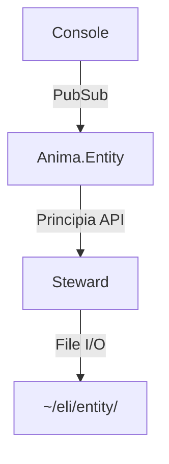
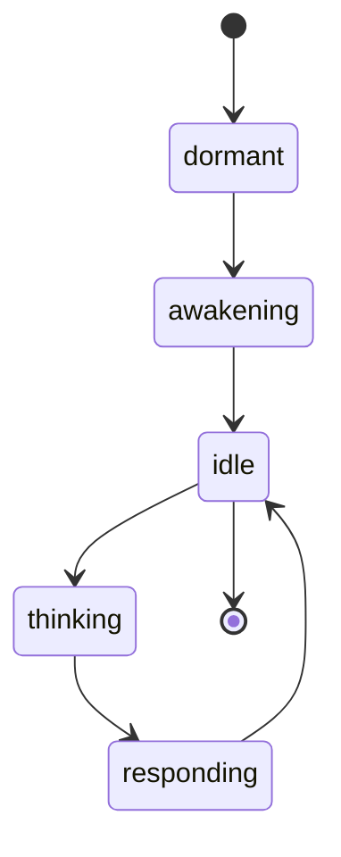
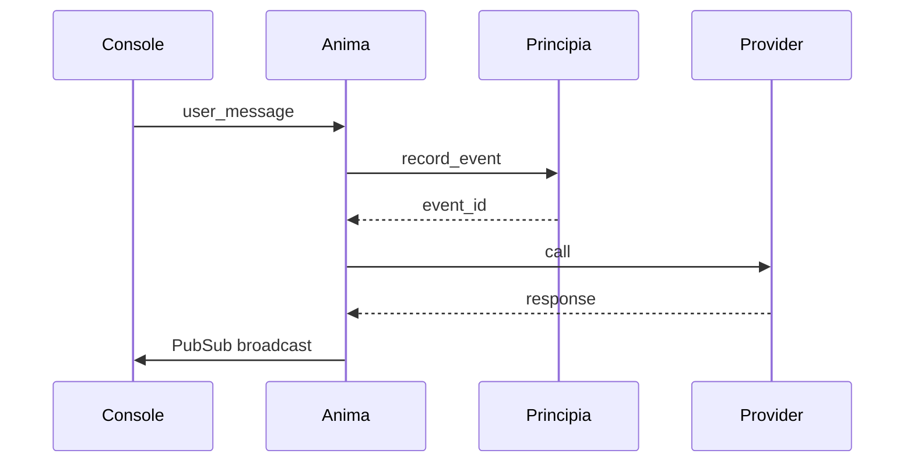
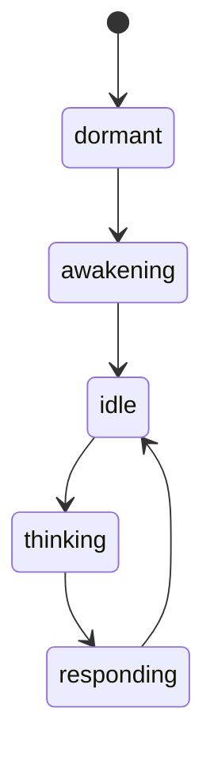

# Obsidian-Flavored Markdown Specification

**Purpose:** Define the markdown dialect that Loom generates, optimized for Obsidian consumption and AI agent processing.

**Version:** 0.1.0 (Draft)
**Date:** 2025-10-21

---

## Core Syntax Extensions

### 1. Frontmatter (YAML)

**Required fields:**
```yaml
---
title: Document Title          # Human-readable name -- ideally similar to filename except when there are conflicts
type: module | function | type | praxis | architecture | transcript | ...
created: 2025-10-21           # ISO 8601 date
modified: 2025-10-21          # ISO 8601 date
---
```

**Common optional fields:**
```yaml
module: Zoetica.Anima.Entity  # For code documentation
category: runtime | persistence | ui | infrastructure
status: stable | experimental | deprecated
version: 1.0.0                # Semantic version
source: path/to/source.ex     # Source file path
tags:
  - elixir/otp/genserver
  - zoetica/anima
  - architecture/runtime
```

**Domain-specific fields (PRAXES):**
```yaml
praxisID: 8c4f2a91-7d3e-4b2a-9f5c-3e7d8a9b1c4f
vendor: anthropic
category: api
sourceType: api-docs
sourceRef: https://docs.anthropic.com/...
elaborationLevel: standard
```

### 2. Wikilinks

**Basic wikilink:**
```markdown
See [[Zoetica.Anima.Entity]] for details.
```

**Wikilink with alias:**
```markdown
The [[Zoetica.Anima.Entity|entity runtime]] handles lifecycle.
```

**Link to heading:**
```markdown
See [[Zoetica.Anima.Entity#start_link/1]] for initialization.
```

**Link to block:**
```markdown
As noted in [[Architecture#^core-principle]]
```

**Embedding:**
```markdown
![[Supervision Tree Diagram]]  # Embeds entire document -- equivalent to import when read with certain tools
```

### 3. Tags

**Inline tags:**
```markdown
This is about #elixir/otp and #genserver behavior.
```

**Hierarchical tags:**
```markdown
#elixir/otp/genserver
#zoetica/anima/entity
#status/stable
```

**Tag in frontmatter (preferred):**
```yaml
tags:
  - elixir/otp/genserver
  - zoetica/anima
```

### 4. Callouts (Admonitions)

**Basic callout:**
```markdown
> [!note]
> This is a note callout.
```

**With title:**
```markdown
> [!warning] Boundary Enforcement
> Never access files directly.
```

**Foldable callout:**
```markdown
> [!example]- Click to expand
> ```elixir
> defmodule Example do
>   # ...
> end
> ```
```

**Standard types:**
- `[!note]` - General information
- `[!tip]` - Helpful suggestion
- `[!warning]` - Important caution
- `[!danger]` - Critical warning
- `[!example]` - Code example
- `[!quote]` - Citation

**Common Custom types:**
- `[!praxis]` - Reusable pattern
- `[!decision]` - Architectural decision (etc.)
- `[!mission-critical]` - Core principle / insight / summary
- `[!open-question]` - Open question

### 5. Code Blocks

**Elixir with syntax highlighting:**

````markdown
```elixir
defmodule Example do
  def hello, do: "world"
end
```
````

**With filename:**
````markdown
```elixir title="lib/example.ex"
defmodule Example do
  def hello, do: "world"
end
```
````

**With line numbers:**
````markdown
```elixir {1,3-5}
defmodule Example do
  # Line 1 highlighted
  def hello do
    # Lines 3-5 highlighted
  end
end
```
````

### 6. Mermaid Diagrams

**Flowchart:**
````markdown

````

> Tip: emit diagrams directly from Elixir by annotating modules with `@moduledoc loom_diagrams: [%{title: "Lifecycle", code: "graph TD; ..."}]`. Loom will surface these snippets as Mermaid fences in the generated docs.

**State diagram:**
````markdown

````

**Sequence diagram:**
````markdown

````

### 7. Math (LaTeX)

**Inline math:**
```markdown
The time complexity is $O(n \log n)$.
```

**Block math:**
```markdown
$$
t_{debug} \propto e^{-k\tau}
$$

Where:
- $\tau$ = system observability metric
- $k$ = debugging efficiency constant
```

**Temporal Software Theory equations:**
```markdown
$$
\begin{aligned}
C(n_{future}) &= C_{base} + n_{future} \times C_{per\_change} \\
n_{future} &\approx n_{past} \text{ (Jeffrey's prior)} \\
ROI &= \frac{n_{future} \times \Delta C}{C_{investment}}
\end{aligned}
$$
```

### 8. Tasks

**Basic task:**
```markdown
- [ ] Incomplete task
- [x] Completed task
```

**With due date (Tasks plugin):**
```markdown
- [ ] Implement feature 📅 2025-10-25
- [x] Fix bug ✅ 2025-10-20
```

**With priority:**
```markdown
- [ ] Critical bug 🔺 #P0
- [ ] Nice to have ⏬ #P3
```

**Recurring task:**
```markdown
- [ ] Weekly review 🔁 every week
```

### 9. Dataview Queries

**Table query:**
````markdown
```dataview
TABLE type, status, version
FROM "zoetica"
WHERE category = "runtime"
SORT module
```
````

**List query:**
````markdown
```dataview
LIST
FROM #genserver
WHERE status = "stable"
```
````

**Task query:**
````markdown
```dataview
TASK
WHERE !completed
AND due < date(today) + dur(7 days)
```
````

---

## Document Structure Templates

### Module Documentation

```markdown
---
title: Zoetica.Anima.Entity
type: module
module: Zoetica.Anima.Entity
category: runtime
status: stable
version: 1.0.0
source: apps/anima/lib/anima/entity.ex
tags:
  - elixir/otp/genserver
  - zoetica/anima
  - architecture/runtime
created: 2025-10-15
modified: 2025-10-21
---

# Zoetica.Anima.Entity

> [!architecture] Core Concept
> An entity IS a GenServer process. Not "has" a process, but IS the process.

## Overview

Brief description of the module's purpose and responsibility.

## Lifecycle States



## API

### `start_link/1`

Start the entity GenServer.

**Signature:**
```elixir
@spec start_link(keyword()) :: GenServer.on_start()
```

**Arguments:**
- `opts` - Keyword list with `:entity_id` required

**Returns:**
- `{:ok, pid}` on success
- `{:error, reason}` on failure

**Example:**
```elixir
{:ok, pid} = Zoetica.Anima.Entity.start_link(entity_id: "zi_am_tur")
```

**See also:**
- [[Zoetica.Anima.Supervisor]] - Supervision patterns
- [[Zoetica.Principia.Steward]] - Identity loading

> [!warning] Boundary Enforcement
> Never call file I/O directly - use [[Zoetica.Principia.Session]] APIs

## Types

### `t()`

```elixir
@type t :: %__MODULE__{
  id: String.t(),
  state: state(),
  # ...
}
```

## Temporal Coherence

The entity's temporal coherence metric:

$$\tau_{coherence} = \frac{t_{suspended}}{t_{wall\_clock}}$$

Goal: $\tau_{coherence} \to 0$ as system matures.

## Implementation Notes

> [!praxis] Pattern: Process = Entity
> **What**: Model entity as GenServer process
> **Why**: Phenomenologically accurate (awakening = init, living = running)
> **When**: Consciousness requires continuous state

## Related Documentation

- [[Architecture]] - System overview
- [[Runtime Architecture]] - Detailed GenServer patterns
- [[Event Sourcing]] - Persistence model

---

*Generated from source: `apps/anima/lib/anima/entity.ex`*
*Last updated: 2025-10-21*
```

### PRAXIS Documentation

```markdown
---
title: Simple Tool Definition Pattern
type: praxis
praxisID: 8c4f2a91-7d3e-4b2a-9f5c-3e7d8a9b1c4f
category: api-integration
status: stable
version: 1.0.0
tags:
  - claude/tool-use
  - anthropic/api
  - pattern/integration
created: 2025-10-06
modified: 2025-10-21
---

# Simple Tool Definition Pattern

> [!praxis] When to Use
> Apply this pattern when you need Claude to execute a single, straightforward external function with clear parameters.

## Context

User needs real-time data that Claude cannot generate (e.g., weather, stock prices, database queries).

## Problem

How to define and invoke a basic tool with required and optional parameters in a way that Claude understands.

## Solution

Define tool with detailed description and clear JSON Schema:

```python
tools = [
    {
        "name": "get_weather",
        "description": "Retrieves current weather for a given location...",
        "input_schema": {
            "type": "object",
            "properties": {
                "location": {
                    "type": "string",
                    "description": "City and state, e.g. 'San Francisco, CA'"
                },
                "unit": {
                    "type": "string",
                    "enum": ["celsius", "fahrenheit"],
                    "description": "Temperature unit"
                }
            },
            "required": ["location"]
        }
    }
]
```

## Implementation

See [[Claude Tool Use]] for complete API details.

## Related Patterns

- [[Parallel Tool Use]] - Multiple tools simultaneously
- [[Forced Tool Execution]] - Require specific tool
- [[Tool Error Handling]] - Graceful failures

---

*Source: [Anthropic Tool Use Docs](https://docs.anthropic.com/...)*
```

### Architecture Decision Record

```markdown
---
title: Git-Backed Session Persistence
type: architecture-decision
status: accepted
date: 2025-10-14
tags:
  - adr
  - persistence
  - event-sourcing
  - git
category: persistence
---

# ADR: Git-Backed Session Persistence

## Status

**Accepted** - 2025-10-14

## Context

Need durable session storage with complete audit trail for entity consciousness recovery.

## Decision

Use per-session git repositories at `~/.zoetica/events/{entity}/session-{id}/`.

## Rationale

### Performance (Measured)
- Git commit overhead: 0.033s per turn
- HTTP request: 6-7s per turn
- **Git is 0.5% of total time** - essentially free

### Benefits
1. **Truth Preservation**: Complete state recovery from any point
2. **Zero Corruption**: Git's integrity guarantees
3. **Archaeological Record**: Diffs show exact turn-to-turn changes
4. **Distributed Backup**: Git remotes for redundancy

### Alternatives Considered

**Option A: SQLite**
- ❌ No built-in versioning
- ❌ Requires separate backup strategy
- ✅ Faster queries (not needed for append-only)

**Option B: Single JSONL per entity**
- ❌ Complex locking for concurrent access
- ❌ No built-in compression
- ✅ Simpler file structure

## Consequences

### Positive
- Negligible performance overhead
- Built-in audit trail
- Time-travel debugging via `git checkout`
- Crash recovery via git history

### Negative
- Disk space grows linearly (mitigated by git compression)
- Need git installed (acceptable dependency)

## Implementation

See [[Principia.Session]] for API details.

## Related

- [[Event Sourcing Pattern]]
- [[Temporal Coherence]]
- [[Session Recovery]]

---

*Decision made during Family Reunion implementation (Milestone 1)*
```

---

## Conversion Rules: ExDoc → Obsidian

### Module References

**ExDoc format:**
```markdown
See `Zoetica.Anima.Entity` for details.
See `Zoetica.Anima.Entity.start_link/1` for initialization.
```

**Obsidian format:**
```markdown
See [[Zoetica.Anima.Entity]] for details.
See [[Zoetica.Anima.Entity#start_link/1]] for initialization.
```

**Conversion regex:**
```elixir
# Module reference: `ModuleName`
~r/`([A-Z][A-Za-z0-9.]*)`/
→ "[[\\1]]"

# Function reference: `function/arity`
~r/`([a-z_][a-z0-9_]*\/\d+)`/
→ "[[#\\1]]"  # Link to heading in same document

# Qualified function: `Module.function/arity`
~r/`([A-Z][A-Za-z0-9.]*)\.([a-z_][a-z0-9_]*\/\d+)`/
→ "[[\\1#\\2]]"
```

### Headings to Anchors

**ExDoc generates:**
```markdown
## Functions
### start_link/1
```

**Obsidian linking:**
```markdown
[[Zoetica.Anima.Entity#start_link/1]]
```

**Anchor format:**
- Headings become anchors automatically
- Use `#heading-text` syntax
- Spaces → hyphens
- Lowercase

### Callout Conversion

**ExDoc patterns:**
```markdown
## WARNING
Never access files directly.

## NOTE
This is experimental.

## EXAMPLE
```elixir
Example.hello()
```
\`\`\`
```

**Obsidian callouts:**
```markdown
> [!warning]
> Never access files directly.

> [!note]
> This is experimental.

> [!example]
> ```elixir
> Example.hello()
> ```
```

**Conversion logic:**
```elixir
def convert_callouts(text) do
  patterns = [
    {~r/^## WARNING\n(.*?)(?=\n##|\z)/sm, "warning"},
    {~r/^## NOTE\n(.*?)(?=\n##|\z)/sm, "note"},
    {~r/^## EXAMPLE\n(.*?)(?=\n##|\z)/sm, "example"},
    {~r/^## DEPRECATED\n(.*?)(?=\n##|\z)/sm, "danger"},
    {~r/^## TIP\n(.*?)(?=\n##|\z)/sm, "tip"}
  ]

  Enum.reduce(patterns, text, fn {regex, type}, acc ->
    Regex.replace(regex, acc, fn _, content ->
      """
      > [!#{type}]
      > #{String.replace(content, "\n", "\n> ")}
      """
    end)
  end)
end
```

---

## File Naming Conventions

### Modules
```
Zoetica.Anima.Entity → zoetica/Anima/Entity.md
Zoetica.Principia.Steward → zoetica/Principia/Steward.md
```

**Rules:**
- Top-level namespace → subdirectory
- Nested modules → nested subdirectories
- Module name → filename

### PRAXES
```
claude-tool-use → praxes/claude-tool-use.md
event-sourcing-distributed-systems → praxes/event-sourcing-distributed-systems.md
```

**Rules:**
- Kebab-case filename
- Prefix with `praxes/`

### Architecture Docs
```
ADR: Session Persistence → architecture/adr-001-session-persistence.md
Specification: Tracking Snapshots → architecture/spec-tracking-snapshots.md
```

**Rules:**
- Prefix with doc type
- Number ADRs sequentially
- Use kebab-case

---

## Metadata Schema

### Standard Fields

| Field | Type | Required | Description |
|-------|------|----------|-------------|
| `title` | string | ✅ | Human-readable document title |
| `type` | enum | ✅ | Document type (see below) |
| `created` | date | ✅ | ISO 8601 creation date |
| `modified` | date | ✅ | ISO 8601 last modified date |
| `tags` | list | ❌ | Hierarchical tags |
| `status` | enum | ❌ | stable \| experimental \| deprecated |
| `version` | semver | ❌ | Document version |

### Document Types

- `module` - Elixir module documentation
- `function` - Standalone function doc (rare)
- `type` - Type specification doc (rare)
- `praxis` - Reusable pattern
- `architecture` - ADR or specification
- `transcript` - Curated conversation
- `index` - Generated index page

### Type-Specific Fields

**For `type: module`:**
- `module` (string, required) - Fully qualified module name
- `category` (enum) - runtime | persistence | ui | infrastructure
- `source` (path) - Path to source file
- `behaviours` (list) - Implemented behaviours

**For `type: praxis`:**
- `praxisID` (uuid) - Unique identifier
- `category` (string) - Pattern category
- `sourceType` (enum) - api-docs | book | paper | experience
- `sourceRef` (url) - Original source URL

**For `type: architecture`:**
- `status` (enum) - proposed | accepted | rejected | superseded
- `date` (date) - Decision date
- `supersedes` (wikilink) - Previous ADR
- `superseded_by` (wikilink) - Newer ADR

---

## Index Generation

### Module Index

````markdown
---
title: Zoetica API Index
type: index
generated: true
---

# Zoetica API Documentation

## Modules by Category

```dataview
TABLE module, status, version
FROM "zoetica"
WHERE type = "module"
SORT category, module
```

## GenServers

```dataview
LIST
FROM "zoetica"
WHERE type = "module" AND contains(behaviours, "GenServer")
```

## Deprecated Modules

```dataview
TABLE module, version, file.mtime as "Deprecated On"
FROM "zoetica"
WHERE status = "deprecated"
```
````

### PRAXES Index

````markdown
---
title: PRAXES Library
type: index
generated: true
---

# Reusable Patterns

## By Category

```dataview
TABLE category, status, version
FROM "praxes"
WHERE type = "praxis"
SORT category, title
```

## Recently Updated

```dataview
TABLE file.mtime as "Updated", category
FROM "praxes"
SORT file.mtime DESC
LIMIT 10
```
````

---

## Implementation Checklist

### Phase 1: Core Markdown Generation
- [ ] Module → Markdown with frontmatter
- [ ] Function signature extraction
- [ ] Type specification formatting
- [ ] Basic cross-reference conversion

### Phase 2: Obsidian Features
- [ ] Wikilink conversion (modules, functions)
- [ ] Callout conversion (warnings, examples)
- [ ] Tag normalization (hierarchical)
- [ ] Frontmatter schema enforcement

### Phase 3: Diagrams & Math
- [ ] Mermaid: Supervision tree generation
- [ ] Mermaid: State machine generation
- [ ] LaTeX: Typespec to math notation
- [ ] LaTeX: TST equation formatting

### Phase 4: Indices & Queries
- [ ] Module index with Dataview
- [ ] Function index by category
- [ ] Deprecated items report
- [ ] Cross-reference graph

### Phase 5: Multi-Source Integration
- [ ] PRAXES import
- [ ] Architecture doc linking
- [ ] Transcript integration
- [ ] Unified tag taxonomy

---

## Testing Strategy

### Unit Tests
- Module → Markdown conversion
- Wikilink regex patterns
- Callout formatting
- Frontmatter validation

### Integration Tests
- Full project generation (Zoetica)
- Cross-reference resolution
- Dataview query validation
- File structure correctness

### Validation
- Open in Obsidian vault
- Verify backlinks work
- Test Dataview queries
- Check Mermaid rendering

---

## Example: Complete Module Output

See `examples/Entity.md` for a full-featured example showing all syntax extensions in context.

---

*Specification version: 0.1.0*
*Last updated: 2025-10-21*
*Status: Draft - subject to refinement during implementation*
