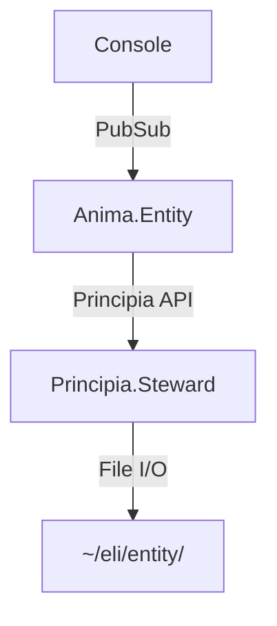

# Loom: Weaving Living Documentation for AI Agents

**Context:** Research session exploring Obsidian's ecosystem to determine what features would benefit AI-agent consumption of documentation, specifically for ELI (Emergent Logozoetic Intelligence) systems like Zoetica.

**Date:** 2025-10-21

---

## The Problem

Current documentation systems (including ExDoc) are optimized for human web browsers:
- HTML output with navigation chrome
- Static cross-references that break when files move
- No queryable metadata beyond basic search
- No automatic relationship discovery
- Visual elements (diagrams) require separate tools

**For AI agents**, we need:
- Structured metadata (queryable fields)
- Automatic bidirectional linking
- Knowledge graph topology
- Semantic markup (warnings, examples, deprecations)
- Formal specifications (math, state machines)

## Research Findings: Obsidian Ecosystem

### Critical Features for AI Consumption

#### 1. Backlinks & Graph View
**The Win:** Automatic relationship discovery without manual maintenance.

Every `[[WikiLink]]` creates:
- Forward link (obvious)
- Backward link (automatic!)
- Graph edge (topology)

**Current state:** Zoetica PRAXES use manual cross-references like `⧼praxis-name⧽` that require maintenance.

**With Obsidian:** `[[Zoetica.Anima.Entity]]` automatically shows up in Entity's backlinks, even from external documents.

#### 2. Frontmatter + Dataview Queries
**The Win:** Structured metadata + dynamic documentation generation.

```yaml
---
module: Zoetica.Anima.Entity
type: genserver
category: runtime
tags:
  - elixir/otp/genserver
  - zoetica/anima
status: stable
version: 1.0.0
---
```

Then query across the entire vault:

````markdown
```dataview
TABLE type, status, version
FROM "zoetica"
WHERE category = "runtime" AND status = "stable"
SORT module
```
````

**Current state:** PRAXES already use frontmatter, but no query capability.

**With Dataview:** Generate indices automatically. "Show me all deprecated functions." "List GenServers by supervision tree."

#### 3. Wikilinks with Aliases
**The Win:** Contextual references that don't break.

```markdown
The [[Zoetica.Anima.Entity|entity runtime]] handles lifecycle...
```

vs current markdown:

```markdown
The [entity runtime](docs/runtime-architecture.md#entity-genserver-state) handles...
```

If you refactor the docs, first link still works. Second breaks.

#### 4. Nested Tags
**The Win:** Hierarchical organization with inheritance.

```yaml
tags:
  - elixir/otp/genserver      # Queryable as #elixir OR #elixir/otp
  - zoetica/anima
  - architecture/runtime
  - status/stable
```

Query for `#elixir` captures all sub-tags automatically.

#### 5. Callouts (Admonitions)
**The Win:** Semantic highlighting for warnings, tips, examples.

```markdown
> [!warning] Boundary Enforcement
> Never call file I/O directly - use [[Zoetica.Principia.Session]] APIs

> [!praxis] Pattern: Simple Tool Definition
> **What**: Define and use a basic tool with required parameters
> **Why**: User needs real-time data
> **When**: Single, straightforward tool
```

Much clearer than section headers.

#### 6. Mermaid Diagrams
**The Win:** Visual architecture as parseable text.

````markdown

````

AI can read the mermaid source to understand topology. Humans get visual diagram.

#### 7. Tasks Plugin
**The Win:** Queryable todos with metadata.

```markdown
- [ ] Implement `Principia.Events.append/3` 📅 2025-10-21
- [x] Wire Console.Session requests ✅ 2025-10-20
- [ ] Stand up proto-alpha smoke tests ⏫ #P0
```

Query: "Show all P0 tasks due this week"

#### 8. Math/LaTeX Support
**The Win:** Formal specifications.

```markdown
$$t_{debug} \propto e^{-k\tau}$$

Where $\tau$ = system observability metric
```

Much clearer than prose descriptions of equations.

---

## What We DON'T Need

- **Excalidraw**: Visual diagrams are opaque to text-based agents (use Mermaid)
- **Slides Extended**: Presentation format doesn't help documentation
- **Canvas**: Visual mind-mapping lacks structure

---

## Architecture Decision: ExDoc Formatter vs Fork

### Option A: Custom ExDoc Formatter (RECOMMENDED)

ExDoc already separates parsing from rendering via the `ExDoc.Formatter` behaviour:

```elixir
defmodule ExDoc.Formatter.Markdown do
  @behaviour ExDoc.Formatter

  @impl true
  def run(nodes, config) do
    # nodes = parsed modules/functions/types
    # config = project settings

    for node <- nodes do
      markdown = generate_obsidian_markdown(node, config)
      write_to_vault(markdown, node, config)
    end
  end
end
```

**Pros:**
- Minimal code (~500 LOC)
- Leverage ExDoc's parsing (mature, handles all edge cases)
- Stays in sync with Elixir updates
- Focus on rendering, not parsing

**Cons:**
- Tied to ExDoc's release cycle
- Limited to what ExDoc extracts

### Option B: Fork ExDoc

Parse AST directly, skip ExDoc entirely.

**Pros:**
- Total control
- Can extract custom attributes ExDoc ignores

**Cons:**
- 5000+ LOC to maintain
- Need to track Elixir syntax changes
- Lots of edge cases (protocols, behaviours, etc.)

### Decision: Start with Option A

Build custom formatter. If we hit limitations, can always add AST post-processing.

---

## The Vision: Loom

**Not just** an ExDoc-to-Markdown converter.

**But:** A markdown project foundation that:

1. **Consumes** multiple sources:
   - ExDoc (Elixir code documentation)
   - PRAXES (reusable patterns)
   - Architecture docs (ADRs, specs)
   - Session transcripts (curated conversations)
   - Research notes (explorations)

2. **Weaves** them together:
   - Automatic cross-linking
   - Unified metadata schema
   - Query across all sources
   - Knowledge graph visualization

3. **Serves** AI agents:
   - Structured, queryable markdown
   - Bidirectional links for context expansion
   - Semantic markup for reasoning
   - Formal specs for verification

### Why "Loom"?

A loom weaves threads into fabric. This project weaves disparate documentation sources into a unified knowledge base.

Threads = ExDoc modules, PRAXES, architecture docs, transcripts
Fabric = Obsidian vault with rich cross-references and queryability

---

## Implementation Roadmap

### Phase 1: ExDoc Formatter (Week 1)
- [ ] Basic markdown generation from ExDoc nodes
- [ ] Frontmatter extraction from module attributes
- [ ] Wikilink conversion for module references
- [ ] File structure (mirrors module hierarchy)

### Phase 2: Obsidian Enhancements (Week 2)
- [ ] Callout conversion (warnings, examples, deprecations)
- [ ] Mermaid diagram generation (supervision trees)
- [ ] Dataview index generation
- [ ] Tag hierarchy normalization

### Phase 3: Multi-Source Integration (Week 3)
- [ ] PRAXES importer (existing frontmatter → normalized schema)
- [ ] Architecture doc linker (ADRs, specs)
- [ ] Cross-source wikilink resolution

### Phase 4: AI Agent Tooling (Week 4+)
- [ ] Graph traversal API
- [ ] Semantic search integration
- [ ] Query builder for common patterns
- [ ] Export to vector DB format

---

## Key Design Principles

### 1. Source of Truth: Code
Documentation is **generated from code**, not manually maintained.

Module attributes drive frontmatter:
```elixir
defmodule Zoetica.Anima.Entity do
  @moduledoc "Entity runtime GenServer"
  @tags ["elixir/otp/genserver", "zoetica/anima"]
  @category "runtime"
  @status "stable"
```

### 2. Links Over Categories
Prefer `[[relationships]]` over rigid hierarchies.

Instead of forcing modules into one category, let them link to multiple concepts:
- [[OTP Supervision]]
- [[Event Sourcing]]
- [[Temporal Coherence]]

Graph topology emerges from links.

### 3. Metadata as First-Class
Every document has queryable frontmatter.

Even hand-written docs should have:
```yaml
---
type: architecture-decision
status: accepted
date: 2025-10-21
tags:
  - adr
  - persistence
  - event-sourcing
---
```

### 4. Visual = Parseable
Diagrams should have text source (Mermaid, not images).

AI reads the source. Humans see the rendering.

### 5. Progressive Enhancement
Start with basic markdown. Add Obsidian features incrementally.

A markdown file without frontmatter is still useful. Frontmatter makes it queryable.

---

## Open Questions

### Q1: Directory Structure?

**Option A: Mirror module hierarchy**
```
vault/
  zoetica/
    Anima/
      Entity.md
      Supervisor.md
    Principia/
      Steward.md
```

**Option B: Flat with namespaced filenames**
```
vault/
  Zoetica.Anima.Entity.md
  Zoetica.Anima.Supervisor.md
  Zoetica.Principia.Steward.md
```

**Recommendation:** Option A. Better Obsidian file explorer UX.

### Q2: How to handle function-level docs?

**Option A: All functions in module file**
```markdown
# Zoetica.Anima.Entity

## Functions

### start_link/1
...

### handle_cast/2
...
```

**Option B: Separate files for large modules**
```
Entity.md             # Overview
Entity/start_link.md  # Detailed function doc
Entity/handle_cast.md
```

**Recommendation:** Option A initially. Option B if modules are huge (>50 functions).

### Q3: How to version documentation?

If vault is git repo, docs version with code.

But what about cross-project links? `[[zoetica/Anima.Entity]]` assumes both in same vault.

**Potential solution:** Obsidian supports multiple vaults. Keep per-project vaults, link via `obsidian://open?vault=zoetica&file=Anima/Entity`.

---

## Success Metrics

### For Humans
- Faster navigation (click instead of grep)
- Automatic index generation (no manual TOCs)
- Visual architecture diagrams (state machines, supervision trees)

### For AI Agents
- Graph traversal (find all modules that depend on X)
- Semantic search (find all GenServers with specific lifecycle)
- Structured queries (show deprecated functions in category Y)
- Formal specs (parse math/mermaid for verification)

---

## Next Steps

1. **Initialize mix project** (`mix new loom --module Loom`)
2. **Create ExDoc.Formatter.Markdown** stub
3. **Test with simple module** (generate markdown, verify wikilinks)
4. **Iterate on frontmatter schema**
5. **Document in obsidian-flavored-markdown.md**

---

*This document captures the research and thinking. See `obsidian-flavored-markdown.md` for the technical specification.*
